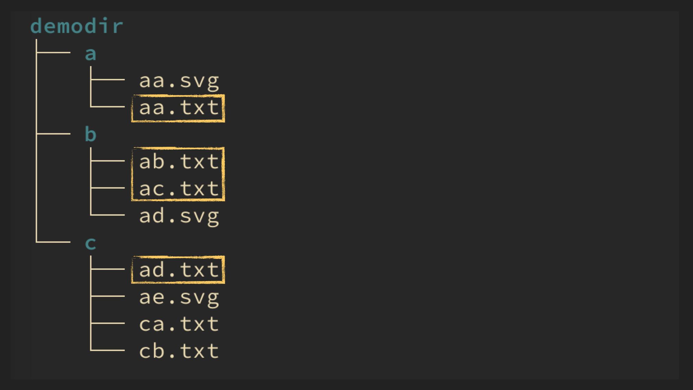
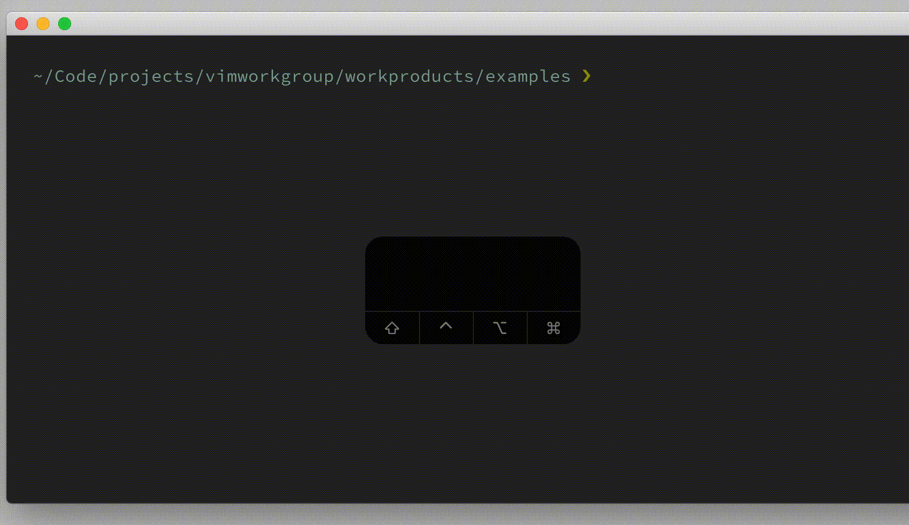

# commandline `Ctrl-a`

## Vim Reference

    :help c_CTRL-A

## Short Description
Insert all args of the current command that match the pattern.

## Examples

I dont't know if this is a good example, but let's assume we want to activate all boolean Vim options that start with
`show*`. This example has only the purpose to demo that it works per ex-command. Hint - for the Vim options that require a
parameter value only their current setting gets printed, in this example `showbreak` and `showtabline`.

The next example is more useful. Opening multiple files at once using a recursive wildcard and a name wildcard.
We have the following fake folder structure with some TXT and SVG files. And we want to open all TXT files that start
with the letter `a`.

The command we could execute is ...

    :argadd demodir/**/a*txt<CR>

... but maybe you want to expand the matches first so that you can check them or modify them. So instead of hitting
`<CR>` right away, you press `<C-a>` to insert all matches of the pattern before the cursor.

    :argadd demodir/**/a*txt<C-a>

