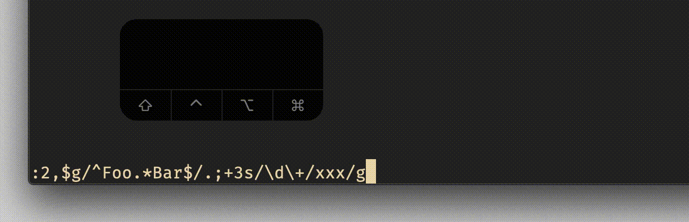

# commandline `Ctrl-b`

## Vim Reference

    :help c_CTRL-B
    :help c_CTRL-E

## Short Description
Move cursor to the beginning of command-line.

## Examples

Let's assume you have written this crazy long command and then for example you need to change the range.
With `Ctrl-b` you can move the cursor at least closer to it. The experienced user knows that there are also other
possibilities, but we will cover them with another letter in the alphabet.

