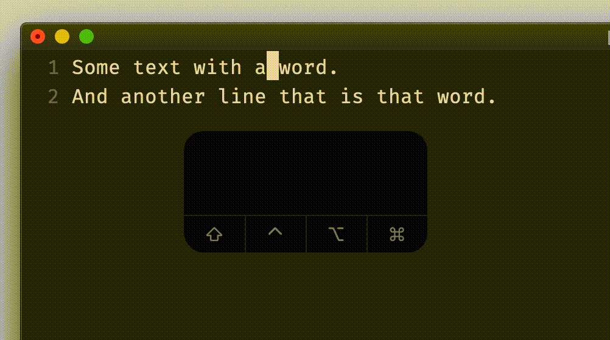

# insert mode `Ctrl-a`

## Vim Reference

    :help i_CTRL-A
    :help i_CTRL-@

## Short Description
Insert previously inserted text.

## Example

What is your use case? In which situation can it be useful?
