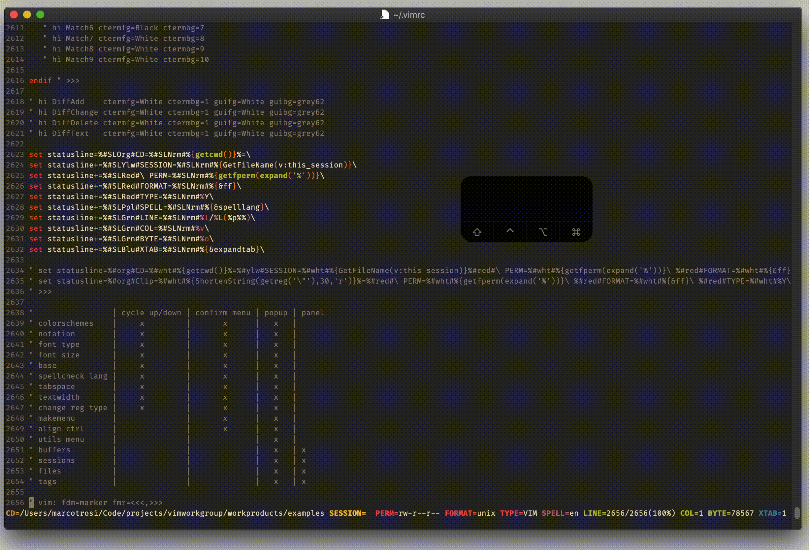

# normal `Ctrl-b`

## Vim Reference

    :help CTRL-B
    :help CTRL-F

## Short Description
Scroll one page backwards.

## Example

Actually there is not much to show. Just press `<C-b>` to scroll full pages backwards.
You can also prepend a number to scroll multiple pages at once.

