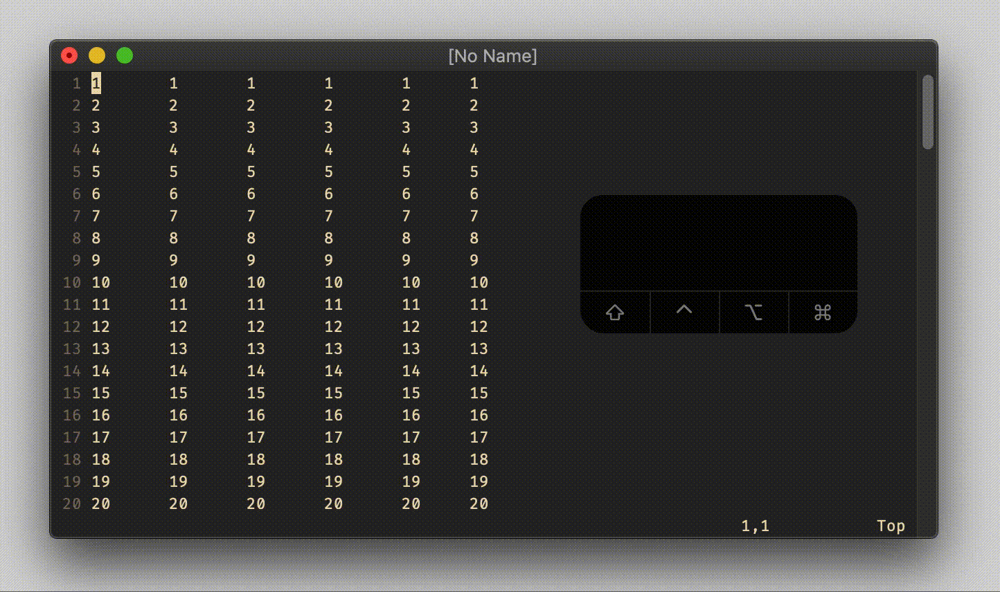

# normal `Ctrl-d`

## Vim Reference

    :help CTRL-D
    :help 'scroll'
    :help CTRL-U

## Short Description
Scroll half page down.

## Example

Actually "half page" is just the default value. `<C-d>` scrolls by the amount given in the `'scroll'` option.

