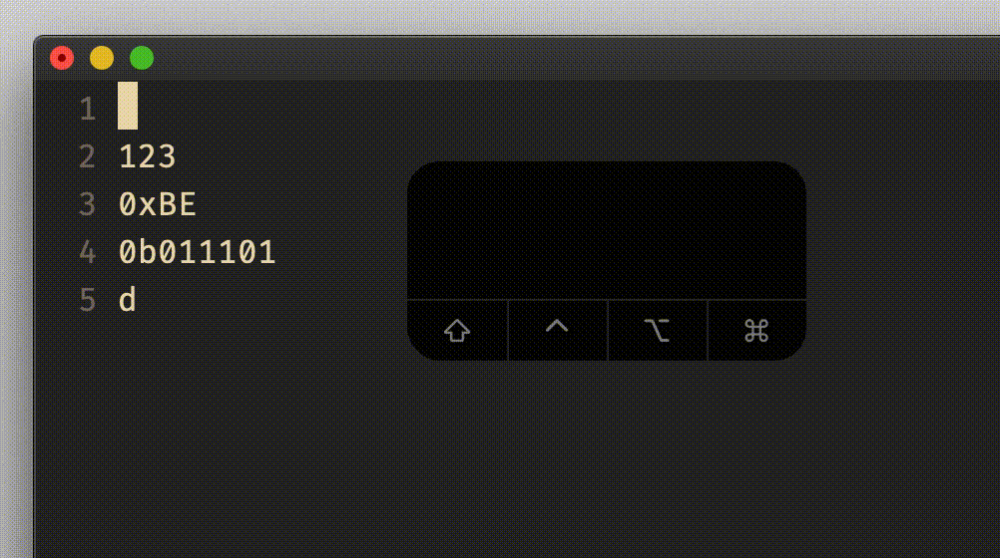
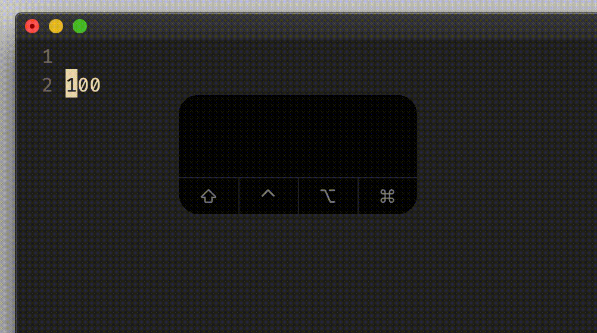
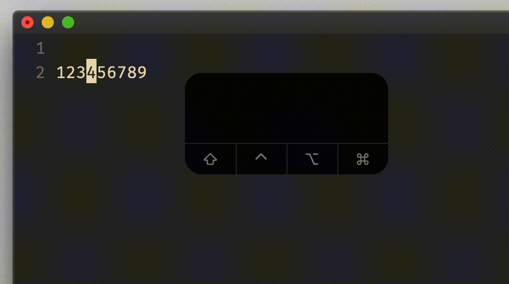
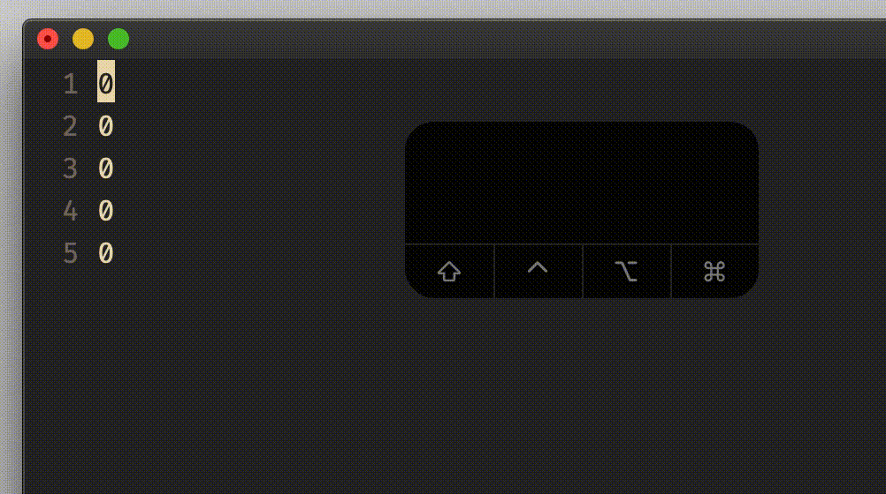
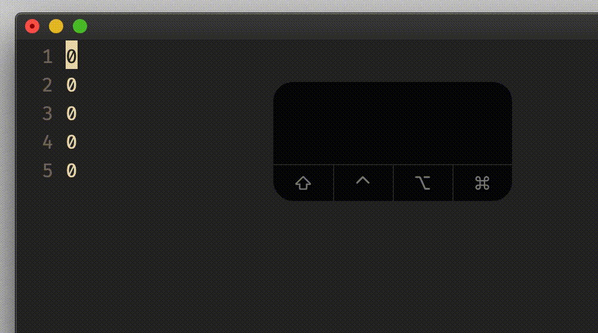

# normal and visual mode `Ctrl-a`

## Vim Reference

    :help CTRL-A
    :help v_CTRL-A
    :help v_g_CTRL-A
    :help 'nrformats'

## Short Description
Increment numbers.

## Examples

### normal mode `Ctrl-a`

Incrementing various number formats. Checkout the `'nrformats'` option for more info.

Incrementing with bigger steps by using a prepended number.

### visual mode `Ctrl-a`

Incrementing only the selected numbers.

Incrementing numbers on multiple lines at once.

A special variant of the `Ctrl-a` command is the `g_Ctrl-a` command,
which increments each number one higher then the one before.

## Also
Of course there are also commands for decrementing numbers. Can you find them in the Vim reference on your own?

