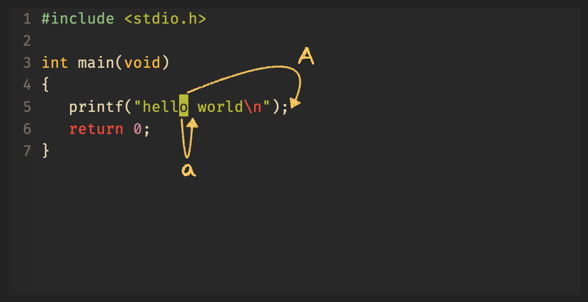
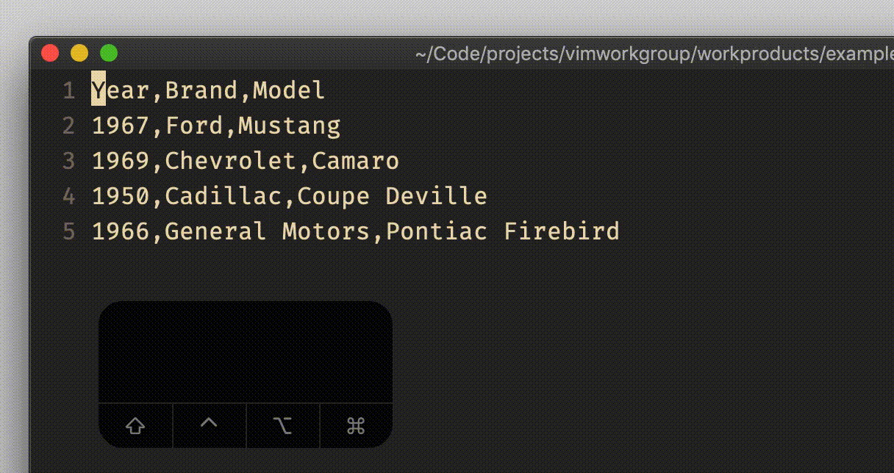
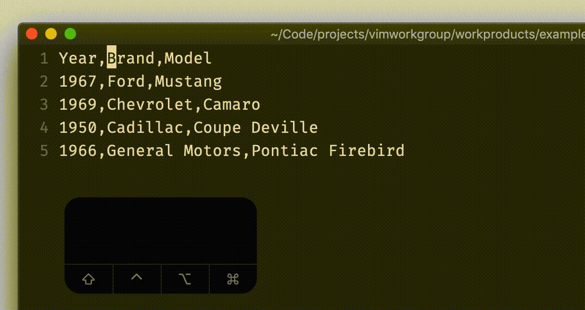
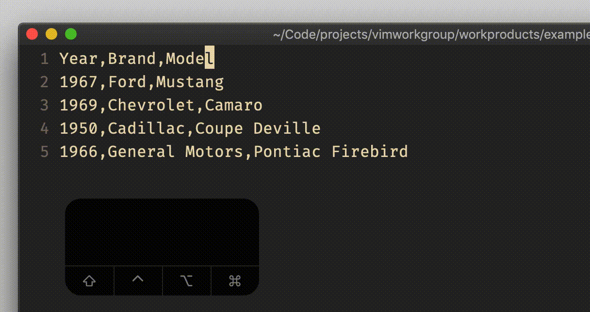

# normal and visual `a`, `A`

## Vim Reference

    :help a
    :help A
    :help v_b_A

## Short Description
Puts Vim in insert mode somewhere after the cursor.

## Examples

### normal mode `a` and `A`

`A` is basically the short form of `$a`, and is useful when you have to append text to a line, for example when you forgot a
semicolon or you want to add a comment to the line.

### visual block mode `A`

In visual block mode the `A` command offers a very handy feature that allows you to add text for all selected lines
after the right side of the selected block.

If you want to append to several lines of various lengths, then you have to press `$` to adjust the
right side of the visual block selection to match the line lengths.

And if you have lines with variable length but you want to append in an aligned manner, then you can set the option
`virtualedit` for example to `block`, which allows you to go beyond the end of line.

    set virtualedit=block

