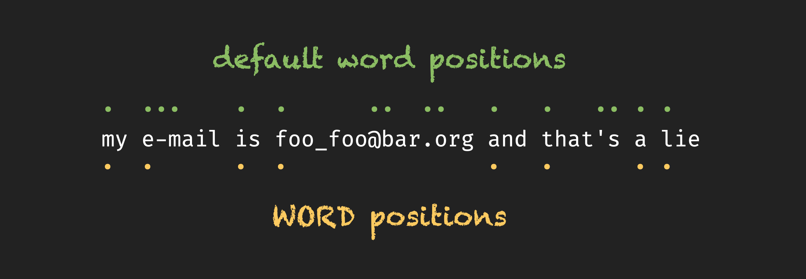
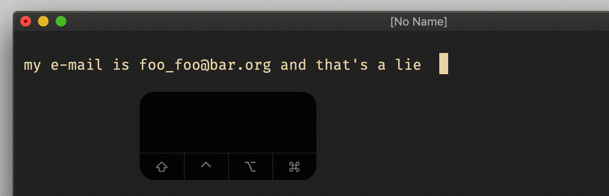
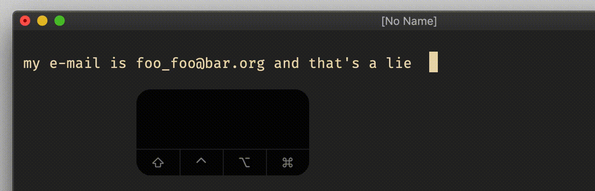
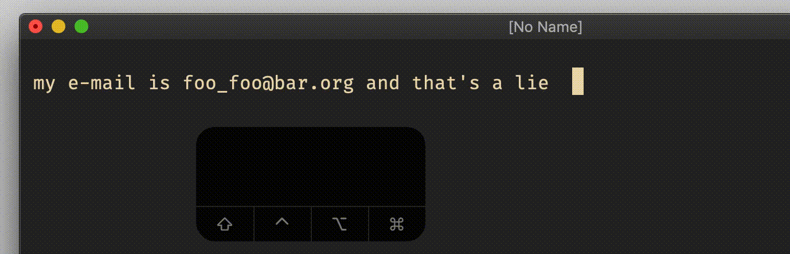
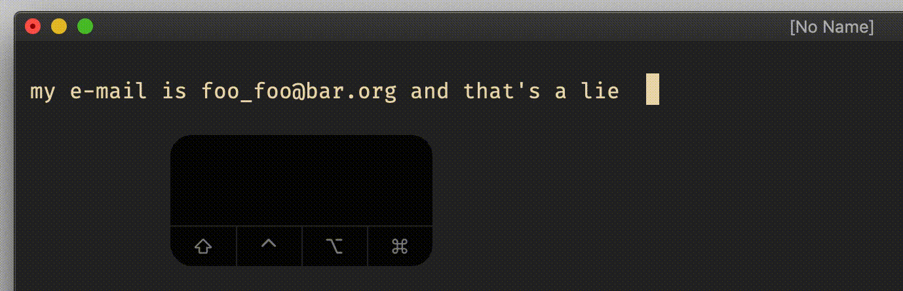

# normal and visual `b`, `B`

## Vim Reference

    :help b
    :help B
    :help word
    :help WORD
    :help 'iskeyword'

## Short Description
Move the cursor backwards to the beginning of the current or previous `word` or `WORD`.

## Examples

To understand the difference between `b` and `B` we have to understand the difference between `word` and `WORD`. `WORD`s
are separated by *spaces*, and `word`s are separated by what is not listed in `iskeyword`. The details for `iskeyword`
we will discuss another day, but this I have to mention - the `@` character in `iskeyword` doesn't represent the `@`
character itself, but it represents all alpha characters `a-zA-Z` and those with accent and umlauts like `áàóòöäüß...`.

### `b` in normal mode

### `B` in normal mode

### `b/B` in visual mode

Of course in visual mode you can use `b` and `B` too to adjust the visually selected text.

### Using `<counter>b/B`

And like for all other motion commands you can prepend with a *counter* to move several `word/WORD`s. The same for visual mode.

    5B
    4b

