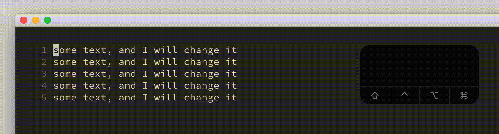

# normal and `c{motion}`, `cc`, `C` and visual `c`

## Vim Reference

    :help c
    :help cc
    :help C
    :help v_c
    :help motion.txt

## Short Description
Delete text and change to insert mode to insert new text.

## Examples
The deleted text goes into the nameless register `""` unless another register is specified. In the examples we will use
register `"a`.

### Deleting text described by a given motion

I will give comment after each command so that you get an idea of motions. But read the help for more info as these
are just some examples of many many combinations of the `c` command and the motions Vim supports.

    cw     " change til end of word
    c)     " change til end of sentence
    ciw    " change word under cursor
    ciW    " change WORD under cursor
    "acw   " change til end of word and and store deleted text in register a
    cip    " change paragraph around cursor position
    cit    " change tag under cursor
    ci(    " change text within parentheses
    ca}    " change text within curly braces including the curly braces
    ci'    " change text within the single quotes
    ca"    " change text within the double quotes including the double quotes
    cG     " change text til end of file
    cgg    " change text til start of file
    cL     " change text til bottom of screen
    cg_    " change text til last non-whitespace character in line

### Deleting lines

    cc
    3cc
    "a3cc
    3"acc

### Deleting from cursor position til end of line

    C
    "aC

### Deleting the visually selected text

    viwc
    Vipc
    Vip"ac

### Deleting the visually block selected text

    <C-v>Gc for demo<ESC>

