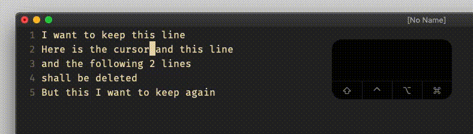
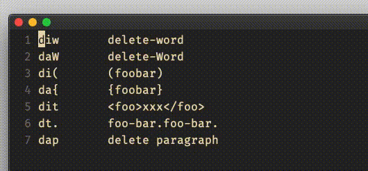
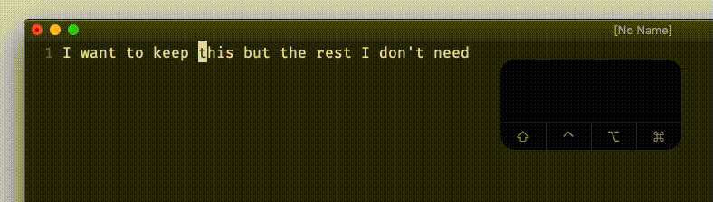
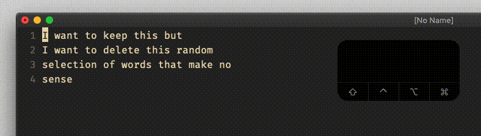
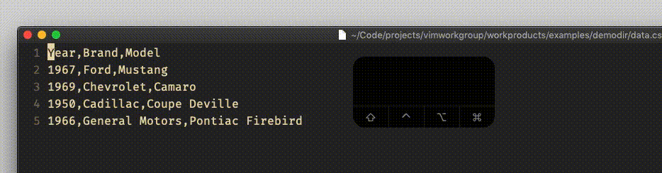

# normal and visual `d`, `D`

## Vim Reference

    :help d
    :help dd
    :help D
    :help v_d
    :help v_D
    :help motion.txt

## Short Description
Delete text.

## Examples

### normal mode `dd`

Deleting full lines can be achieved with the `dd` command. It deletes them into the nameless register `""` which is the
default unless you provide another register. Here are some examples ...

To delete the current line

    dd

To delete 3 lines

    3dd

To delete into register `a`

    "add
    3"add
    "a3dd

### normal mode `d`

The `d` command needs be followed by a *motion* and can optionally be prepended with a counter just like for the `dd`
command.

    diw
    daW
    di(
    da}
    dap
    dit
    d$
    dG
    "ad3w
    "adgg
    dt.

Here some examples ...

### normal mode `D`

This simply deletes from cursor position until end of line and is therefore the same as `d$`.

### visual mode `d`

In any visual mode you can delete the selected text by pressing `d`.

### visual block mode `D`

In visual block mode the `D` command deletes the selection and additionally until end of line.

