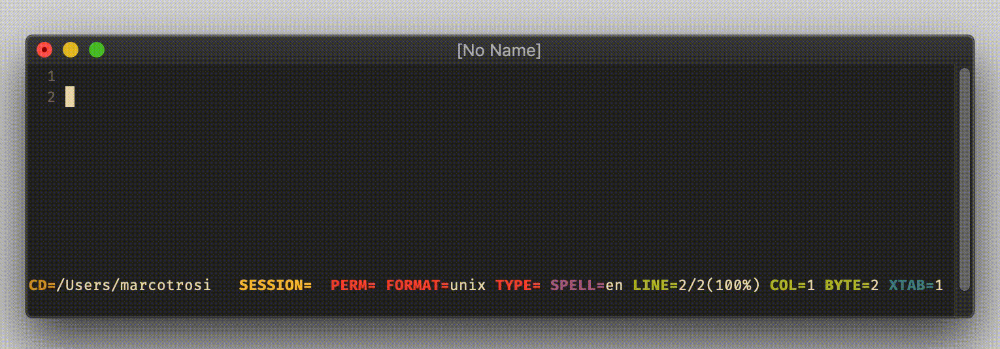
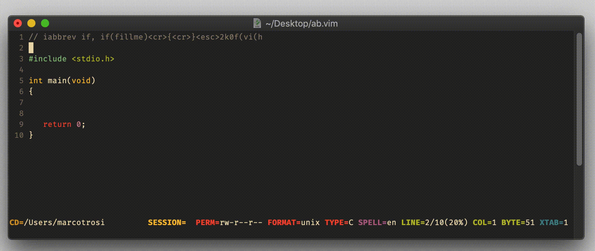
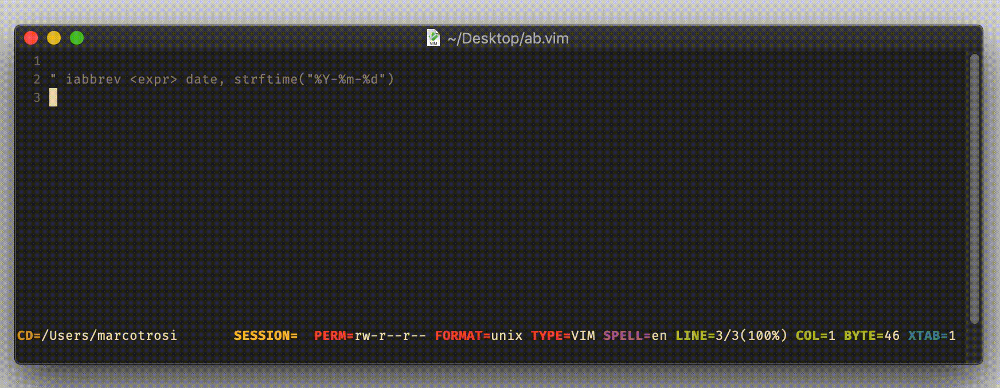
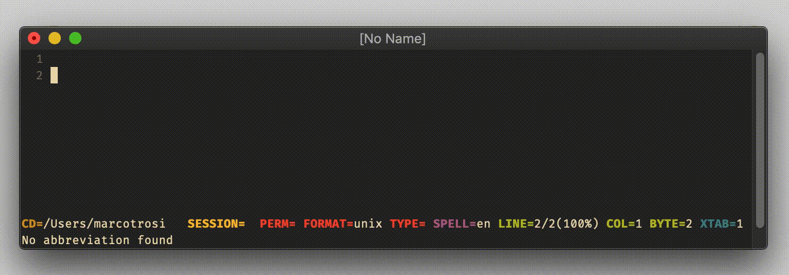
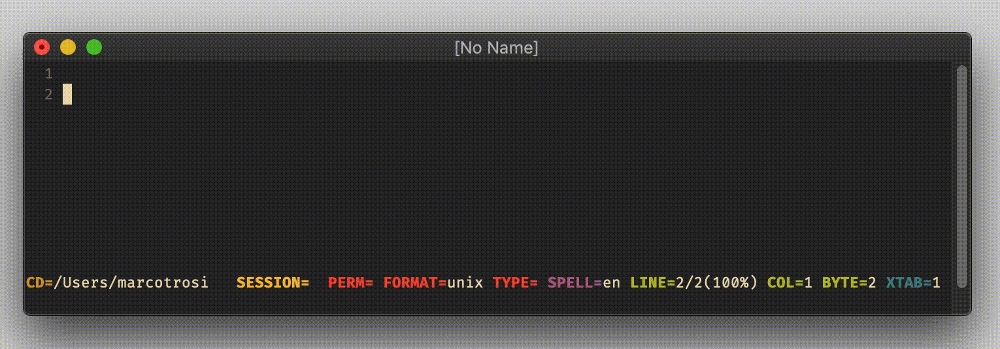

# excommand `abbreviate`

## Vim Reference

    :help :abbreviate
    :help :noreabbrev
    :help :unabbreviate
    :help :abclear

The commands shown above are for insert mode and commandline mode. There are variants only for insert or commandline mode.

> Most of the time you probably need the insert mode abbreviations.

## Short Description
List, create or remove abbreviations.

## Examples

### Creating an abbreviation

#### Fixing typos

    :abbreviate teh the

#### Expanding snippets

    iabbrev if, if(fillme)<cr>{<cr>}<esc>2k0f(vi(h

> using the comma after `if` allows you to still write yourself an if-statement, and you can use other characters like
> dot, colon, and so on to create variations of your if-statement.

#### Using `<expr>`

    :iabbrev <expr> date, strftime("%Y-%m-%d")

### List abbreviations

    :abbreviate

> The exclamation mark `!` means that the abbreviation is for insert and commandline mode. 
> An `i` means for insert mode only, and a `c` means commandline mode only.

### Remove abbreviations

To remove a specific abbreviation.

    :unabbreviate abname

To remove all abbreviations.

    :abclear

## External Links
- [LVSTHW - Abbreviations](https://learnvimscriptthehardway.stevelosh.com/chapters/08.html)
- [Tim Pope - vim-abolish](https://github.com/tpope/vim-abolish)
