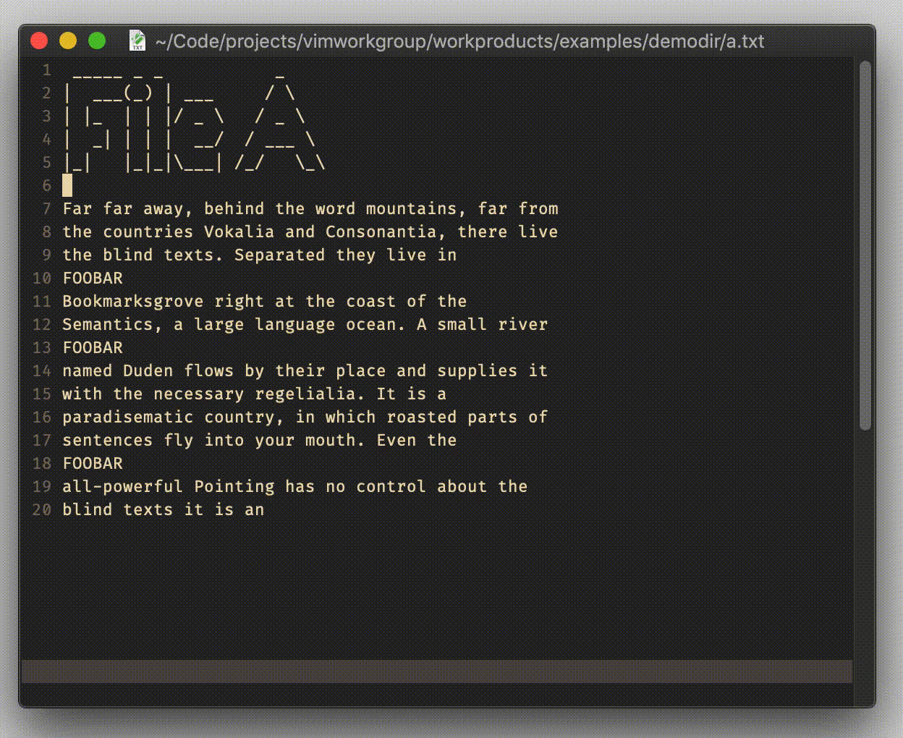

# excommand `argdo`

## Vim Reference

    :help :argdo

## Short Description
Execute a command for each file in the argument list.

## Example

This example requires some explanation.
In the following GIF you see 3 files that contain some lines "FOOBAR" that we want to delete.
`argdo` will iterate all 3 lines from the arglist, and execute for each file the line deletions and saving the file
using the write command.

> Be aware that the arglist is a subset of the bufferlist and there is `:bufdo` for that.
> The file saving is required otherwise the file iteration fails. Alternatively you can use `:set hidden`.
