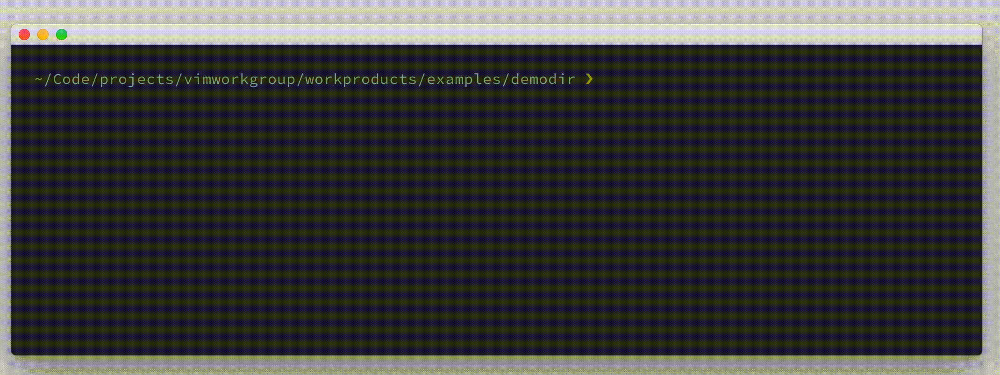
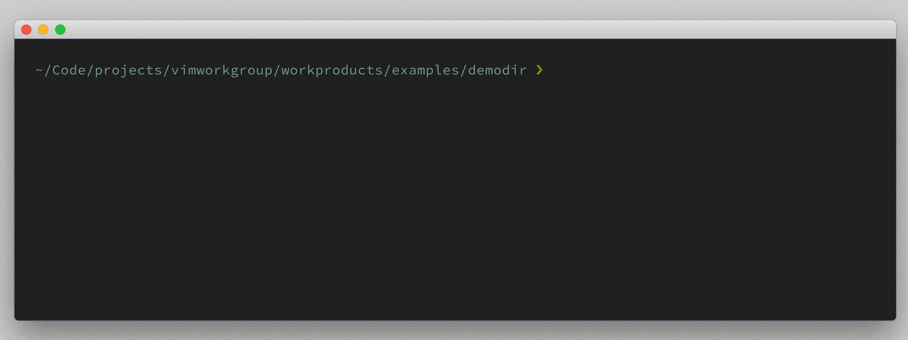

# excommand `args`

## Vim Reference

    :help :args

## Short Description
Print argument list OR set a new args list.

## Examples

Print current argument list. Notice that the buffer list (`:ls`) is different from the argument list.

Set new argument list.

