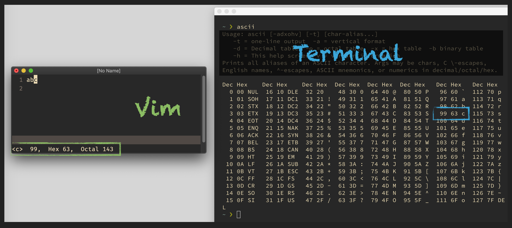

# excommand `ascii`

## Vim Reference

    :help :ascii
    :help ga

## Short Description
Print the ascii value of the character under the cursor.

## Example

Using `:ascii` on the character `c` results in a small print in the bottom left corner.
The image shows Vim on the left and a terminal on the right in which an ASCII table was printed.
Both show a decimal value of 99 and a hex value of 0x63.

> As you have 2 commands (:ascii and ga) that are doing the same, one could potentially use `ga` for something else.
> But of course `ga` is the one easier to execute. So you have to decide yourself if it's worth the trade-off.
