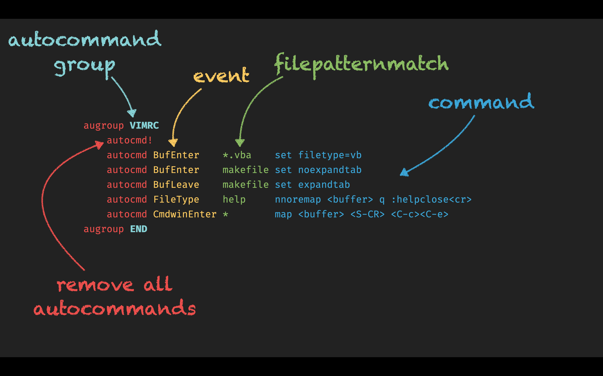
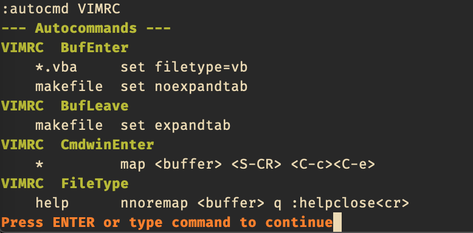

# excommand `autocmd`

## Vim Reference

    :help autocommand
    :help :autocmd
    :help :augroup
    :help autocommand-events
    :help autocmd-list
    :help autocmd-remove

## Short Description
Create, list or remove autocommands that execute a *command* automatically on an *event* for a file matching a *pattern*.

## Examples
As this is a bigger topic and I can't give an example for every user case, I thought it might be good to explain a bit
more. In the short description you see 3 emphasized words (command, event, pattern). That's the core of autocommands.
You can automatically let Vim execute a command like e.g. setting options, for specific files that match a patter like
e.g. `*.txt`, but only on certain events like e.g. reading a buffer. But it could be almost anything.

You could for example let Vim re-indent the code every time you save a C source file.
Or you could let Vim run the external `ctags` program when you haven't pressed a key within 5 seconds.
Or you could change the colorscheme automatically when open a file of a specific programming language.

So the *commands* and *file pattern* are pretty self-explanatory, but for the *events* I recommend that you read the Vim
reference listed above, so that you get some ideas for what you could use the autocommands.

### Creating an autocommand

> First thing to know is that it's a good practice to put your autocommands in a autocommand group with a unique name
> and to remove all existing autocommands of that group in the beginning. Even in your .vimrc file.

Here are some random examples.

    augroup VIMRC
        autocmd!
        autocmd BufEnter *.vba set filetype=vb
        autocmd BufEnter makefile set noexpandtab
        autocmd BufLeave makefile set expandtab
        autocmd FileType help nnoremap <buffer> q :helpclose<cr>
        autocmd CmdwinEnter * map <buffer> <S-CR> <C-c><C-e>
    augroup END

> In case of the `FileType` event the file pattern match matches against the *filetype* and not the filename.

> When `autocmd!` is used inside an `augroup` then this group is used automatically. It's like `autocmd! VIMRC` in the example above.

### Listing an autocommand

There are several ways to list the currently defined autocommands. You can list all autocommands, or all of an augroup, or all
matching the pattern, or for a specific event, .... Here some examples.

    :autocmd VIMRC
    :autocmd BufEnter
    :autocmd * makefile

### Removing an autocommand

Removing works like listing autocommands, but with the exclamation mark.

    :autocmd! VIMRC
    :autocmd! BufEnter
    :autocmd! * makefile
