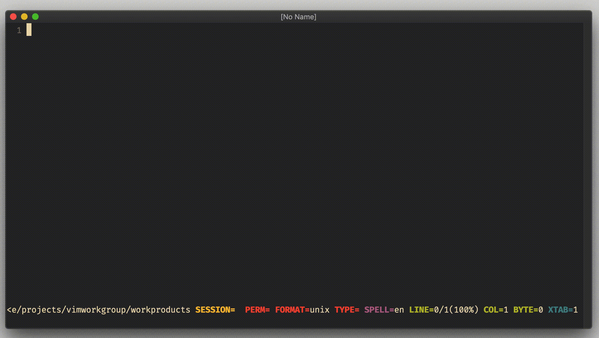
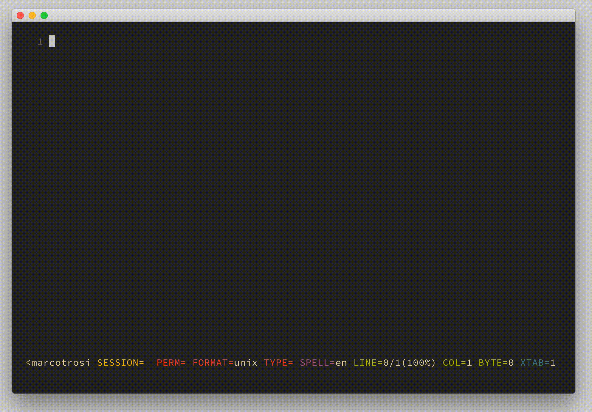

# excommand `browse`

## Vim Reference

    :help :browse
    :help :oldfiles

## Short Description
Open a file selection dialog for an argument to the given command.

## Examples
This command is mainly for a Vim with GUI, but we also have one good commandline use case that is supported.

### Use `browse` in GUI Vim
So the `:browse` command is used to get a file dialog for the arguments that you have to pass to the command that you
passed to `:browse`. Many commands are supported.

Let's make an example with the `:e` command that usually gets called with a filename as argument.

    :e foobar.txt

And with `:browse` a GUI Vim will provide you a file browser for the parameter to `:e`.

    :browse e

## Use `browse` to open from oldfiles list
But we have also one great use case that is also supported when using a terminal Vim,
and that is to open from the list of old files.
Vim has a command named `:oldfiles` to list all files from the `.viminfo` file that you had open in the past.

    :oldfiles

And when we combine it with `:browse` then you can open one of these files you edited in the past.

    :browse oldfiles

This is basically the built-in solution similar to a MRU (most recently used) plugin.

