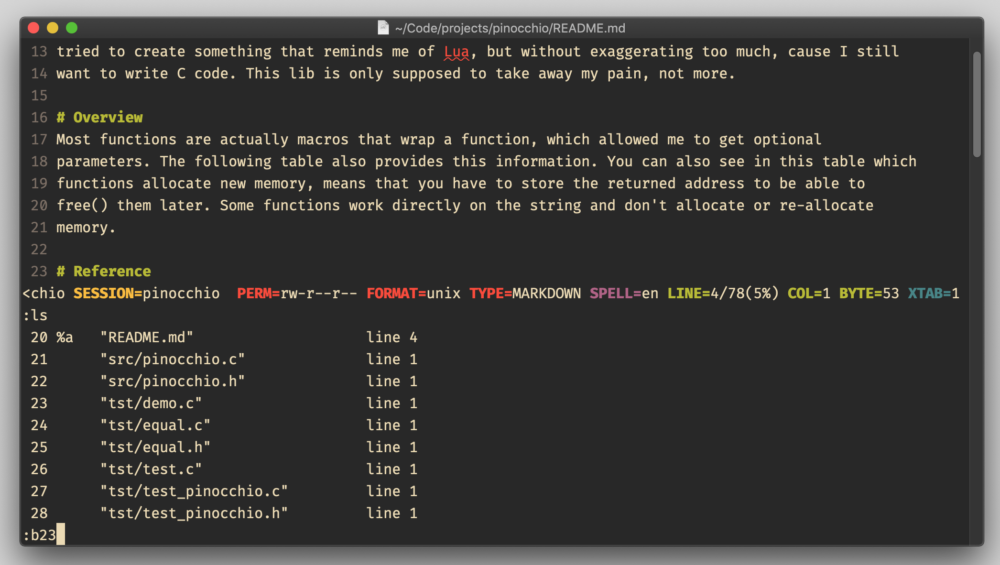

# excommand `buffer`

## Vim Reference

    :help :buffer
    :help +cmd
    :help CTRL-^

## Short Description
Edit given buffer.

## Examples

### editing by buffer number
If you read the reference, which I hope you do, you can see that the buffer number can be given as *counter* or as
*parameter*. So the following seems to be equivalent if we want to edit buffer number 4 ...

    :buffer 4
    :b 4
    :b4
    :4b

You can also run the command directly after running `:ls` or `:ls!` to see the buffer list, which is very useful because
who the heck knows the buffer numbers by heart?!

### editing by file name

You can also use the `<TAB>` key to use filename completion.

    :b filename

### editing the alternate buffer

As an alternative to `Ctrl-^`.

    :b#

### passing various commands to `:buffer`

#### put cursor on last line

    :b + 4
    :b + filename

#### put cursor on given line number

    :b +42 4
    :b +42 filename

#### put cursor on first line matching pattern

    :b +/pattern 4
    :b +/pattern filename

#### execute command after opening buffer

    :b +command 4
    :b +command filename

Like in the following example, and notice that you have to protect the whitespace ...

    :b +set\ ft=py myFile.py.bak
    
