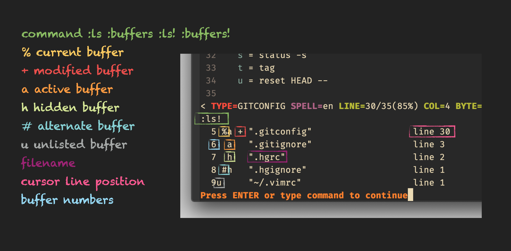

# excommand `buffers`

## Vim Reference

    :help :buffers
    :help :ls

## Short Description
Print buffer list.

## Example

Print current buffer list.

Here some more information regarding *unlisted buffers*

- the unlisted buffers get only printed when you adde the `!` to the command
- unlisted buffers can be opened again with the `:buffer` command
- a buffer becomes an unlisted buffer when you delete it using `:bdelete`
- deleting a buffer with `:bwipeout` doesn't make it an unlisted buffer, it gets removed completely
