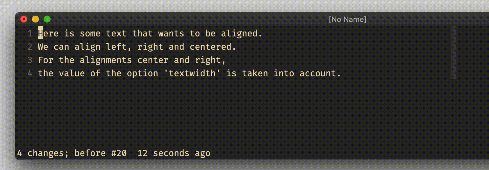

# excommand `center`

## Vim Reference

    :help :center
    :help :left
    :help :right

## Short Description
Aligned text centered.

## Examples

There is not much to explain. Just select the lines you want to align and run the `:center` command.

