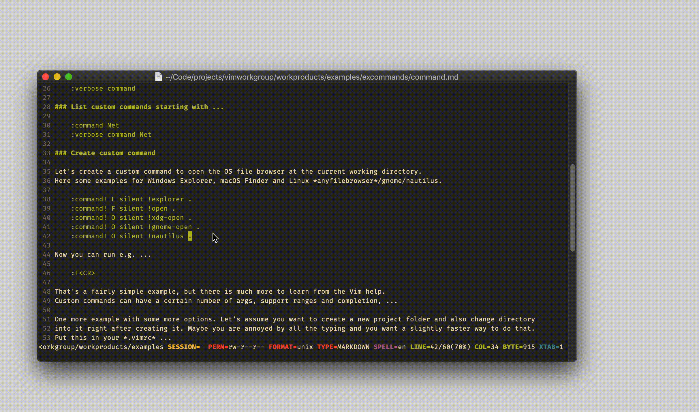

# excommand `command`

## Vim Reference

    :help :command
    :help :delcommand
    :help :comclear
    :help :command-nargs
    :help :command-complete
    :help :command-range
    :help :command-addr
    :help :command-bang
    :help <registers>
    :help <args>
    :help <q-args>
    :help <f-args>

## Short Description
List and create custom commands.

## Examples

### List all custom commands

    :command
    :verbose command

### List custom commands starting with ...

    :command Net
    :verbose command Net

### Create custom command

Let's create a custom command to open the OS file browser at the current working directory.
Here some examples for Windows Explorer, macOS Finder and Linux *anyfilebrowser*/gnome/nautilus.

    :command! E silent !explorer .
    :command! F silent !open .
    :command! O silent !xdg-open .
    :command! O silent !gnome-open .
    :command! O silent !nautilus .

Now you can run e.g. ...

    :F<CR>

That's a fairly simple example, but there is much more to learn from the Vim help.
Custom commands can have a certain number of args, support ranges and completion, ...

One more example with some more options. Let's assume you want to create a new project folder and also change directory
into it right after creating it. Maybe you are annoyed by all the typing and you want a slightly faster way to do that.
Put this in your *.vimrc* ...

    command! -nargs=1 MKCD call mkdir(<f-args>, "p") | call chdir(<f-args>)

... and now you can run ...

    :MKCD mynewproject

... and it will create the folder *mynewproject* and also perform the directory change.

