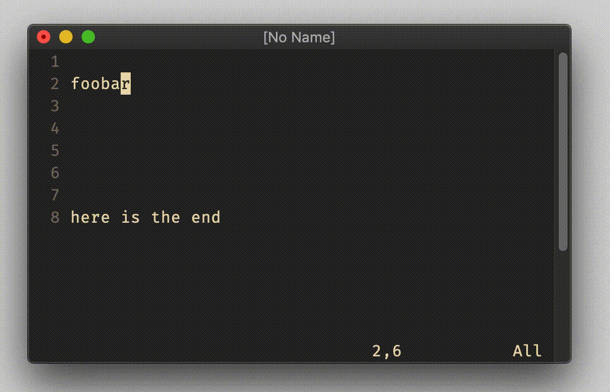

# excommand `copy`

## Vim Reference

    :help :copy
    :help :t
    :help :move
    :help :range

## Short Description

Copy the lines of the given range below the given line.

## Examples

To be honest, the more complex part of the copy command is the range that can be given.
I will give here only simple examples for ranges.

Copy the current line to the end of the file/buffer.

    :.copy$
    :.co$
    :.t$

`.` means *current line* and `$` is here the destination which is *after the last line*, which makes it the new last
line.

Copy the lines 3 til 10 and insert after line 15.

    :3,10co15

Copy the lines from 3 before til 5 after the current line to 10 lines after the current line.
For relative ranges it can be useful to turn *relative line numbers* on.

    :set relativenumber
    :-3,+5co+10

Copy the range from current line til last line to the beginning of the file.

    :.,$co0

