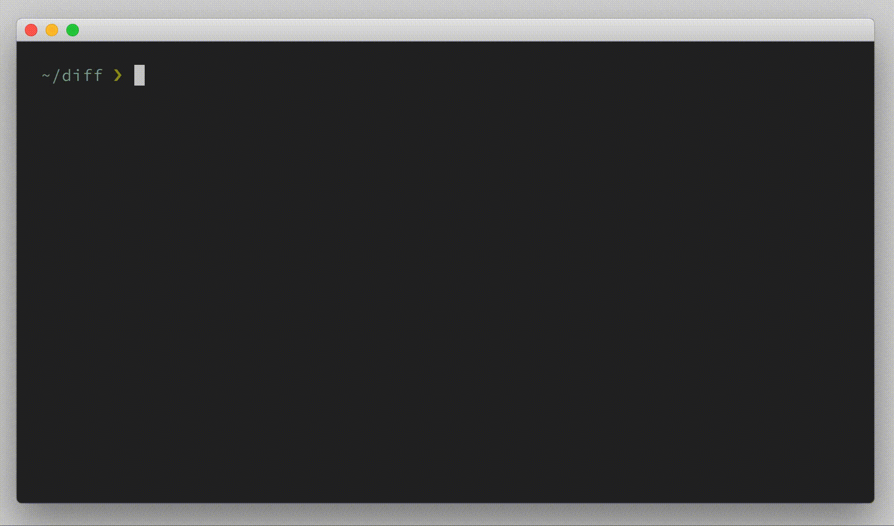
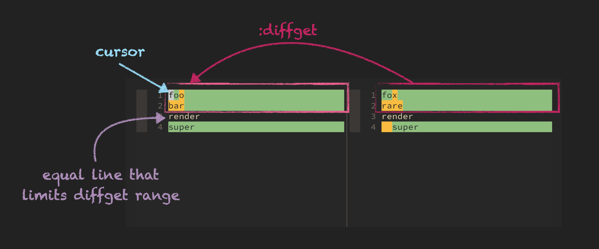

# excommand `diffget`, `diffoff`, `diffpatch`, `diffput`, `diffsplit`, `diffthis`, `diffupdate`

## Vim Reference

    :help :diffsplit
    :help :diffthis
    :help :diffget
    :help do
    :help :diffput
    :help dp
    :help :diffpatch
    :help :diffupdate
    :help :diffoff

## Short Description

A group of commands for handling *diffs*.

## Examples

I didn't want to split these commands as the reader is most likely interested in all of them.

### Starting a Diff

I suppose that most of the time you would start Vim directly in diff mode with 2-8 files as args on the commandline.
Something like ...

    vim -d fileA fileB
    vimdiff fileA fileB
    vimdiff fileA fileB fileC
    vimdiff file*

#### `:diffsplit`

But let's say you got `fileA` already open and after some time you have the idea to compare it to `fileB`. In this case
you don't have to close Vim, but instead you can use the `:diffsplit` command to start the *diff*.

    :diffsplit fileB
    :belowright diffsplit fileB

As you can see the `diffsplit` command splits automatically vertically and there is no need to specify that explicitly.
You can even run the command again with a third file ...

    :belowright diffsplit fileC

... and it's just like as you would have given all 3 files as arguments to `vimdiff`.

#### `:diffthis`

Now let's assume you already have a vertical split with the 2 files of interest open side by side, then you can use the
`diffthis` command to start the *diff* without opening further split windows. You just have to run this command in both
windows *et voilà* - you've started *diff* mode manually. A quick way to do this is ...

    :windo diffthis

### Merging and Patching

Of course sometimes you only want to see the differences between 2 files e.g. 2 versions of the same file to see what
has been changed. But sometimes you want to copy the changes from one file to the other. For sure you still can use
simple editing methods and copy/paste to achieve the same, but Vim also supports you with some classic merging features.

#### `:diffget`

This command gets you the changes from the other split windows and puts them into the currently focused buffer where
your cursor is. If there is more than one split window then you have to tell the command from which split window you
want to get the changes. This could be the buffer number or parts of the filename. You can call `diffget` with a range,
but when called without a range then by default it automatically selects all the lines with changes around the current
line. So a line without any changes ends this automatic range. Okay enough talking, let's have a look at some examples...

    :diffget
    do

    :1,3diffget

    :diffget fileC
    3do

#### `:diffput`

`:diffput` is putting the differences from the current buffer/split window to the other buffer/split window.
The same rules for ranges and buffer number or name apply as for `diffget`.

    :diffput
    dp

    :1,3diffput

    :diffput fileC
    3dp

#### `:diffpatch`

Upfront a brief excursion to the commandline tools `diff` and `patch`. These 2 Unix tools are used to see and store
differences between 2 files and to apply the differences to other files. I suppose that one of the main reasons for
these commands is to reduce data, especially when sending files over network. Assume you have a 5MB file and you do a
little change, so instead of sending the whole 5MB to someone else you simply create a small *patchfile* that contains
the differences and then this *patchfile* can be send to someone else, and the person on the other side can apply the
changes to the same 5MB local file. Let's do this on commandline and then again using Vim.

    cp BigFile BigFile.new                    # copy the big file
    vim BigFile.new                           # do some edits
    diff BigFile BigFile.new > BigFile.patch  # create patchfile

Now let's send the *patchfile* to another user that also has the `BigFile`.
This user can apply the *patch* using the `patch` tool.

    patch -o BigFile.new BigFile BigFile.patch

Both `BigFile.new` files on both computers are now the same.
Let's repeat the last step, the patching, with Vim.

    vim BigFile               # open the big file
    :diffpatch BigFile.patch  " apply the patchfile

These creates a new file named `BigFile.new` which has the applied changes, and you can see the changes because Vim
opens the newly created file in diff view with the original file. You can use again `belowright` if you want the patched
file on the right side.

In the screenrecording I apply the patch file to the original file, just to show how it works. Don't get confused by that.

### Other Commands

#### `:diffupdate`

There is not much to say about this command. This just re-runs the diff again which can be useful when one or more files
from the diff have been updated in the background.

    :diffupdate!

#### `:diffoff`

And this command is also quite self-explanatory, it simply turns off any comparison and the diff highlighting for the
current window and is therefore basically the counter part to the `diffthis` command. The split windows remain as they are.
If you add an `!` then the command is executed for all windows on this tab page.

    :diffoff!
    :windo diffoff

