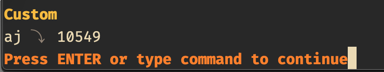

# excommand `digraphs`

## Vim Reference

    :help :digraphs
    :help digraph_set()
    :help i_CTRL-K
    :help i_digraph

## Short Description

Displaying and adding digraphs.

## Examples

### Displaying Digraphs

If you want to look up the digraphs you can simply run `:digraphs!` and Vim will display the list of known digraphs with
headings. If you omit the `!` then no headings are printed. Use the `j` and `k` keys to scroll down and up single lines,
`d` and `u` to scroll half pages, press `q` to close the display. 

### Adding Digraphs

Let's say you are missing some Unicode characters that you want to enter with the digraph insertion methods that Vim
provides, then you can add these characters to the list of digraphs with the `:digraph` command as follows ...

You need to know the __decimal__ value of the Unicode character you want to add. There are probably many sites that have
lists of Unicode characters from which you can grab the required decimal value, here is one of them.
[https://unicode-table.com/](https://unicode-table.com/). Alternatively you can paste the desired character into a Vim
buffer, put the cursor on it and press `ga` and the decimal value should be printed in the Vim commandline.
Next you have to think of 2 characters that you want to enter to insert the digraph character. Make sure that the 2
characters are not already used for a digraph character that you need too.

Let's pretend you need this arrow here ⤵ with the decimal value 10549, and the characters with which you want to trigger its insertion are `aj`, then
your command to add this digraph would be ...

    digraph aj 10549

If you now run again the `:digraphs!` command, then you can see that your new digraph as been added to the _Custom_
section at the end.

