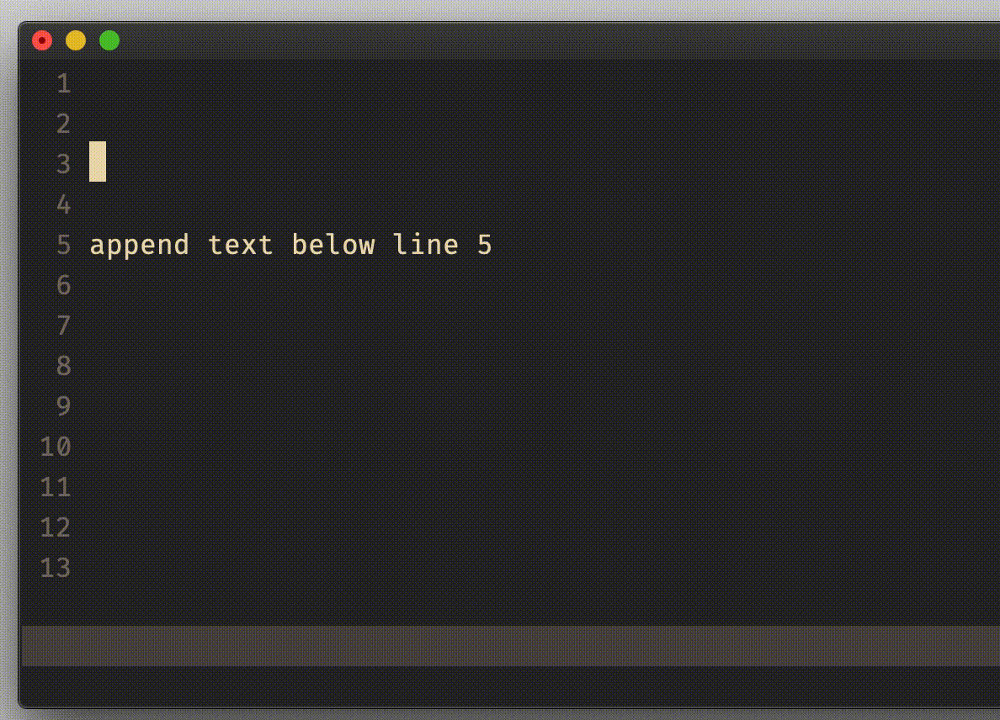
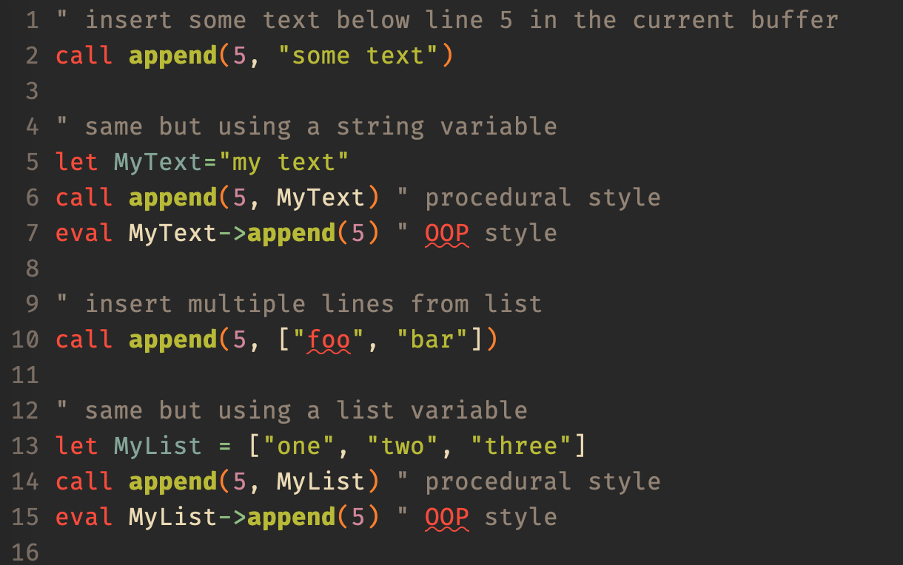

# function `append()` and `appendbufline()`

## Vim Reference

    :help append()
    :help appendbufline()

## Short Description
Append text below a given line in a buffer.

## Examples

### append string

    call append(5, "foobar")

### append list

    call append(5, ["one","two","three"])

### append examples

### appendbufline examples

