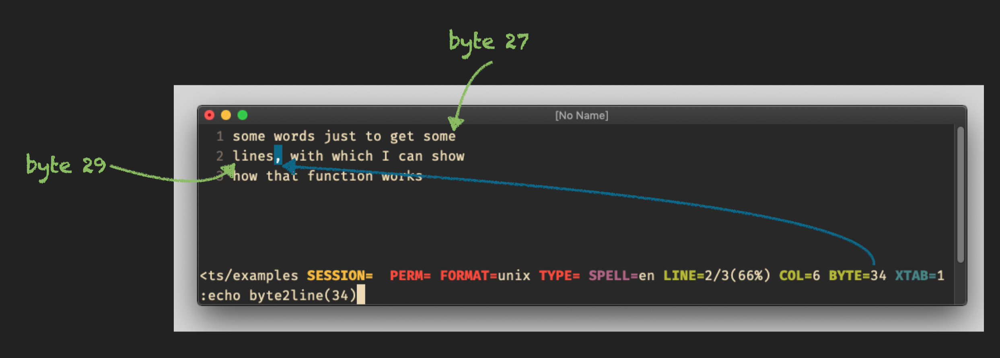

# function `byte2line()`

## Vim Reference

    :help byte2line()
    :help line2byte()

## Short Description
Get the line number that contains the character at the given byte count in the current buffer.

## Examples

Get line number of the character that is at byte count 234.

    let LineNumAtByte=byte2line(234)

Here another small example that shows how the bytes are count. The comma, which is at byte position 34, is in line 2,
and therefore the return value of `byte2line()` is 2. You can see that the newline character is of course also a byte in
the file, which in this case is stored in the Unix format (see statusline). Means for the Windows format there 2 bytes
for each line break, because of `\n` and `\r`.

