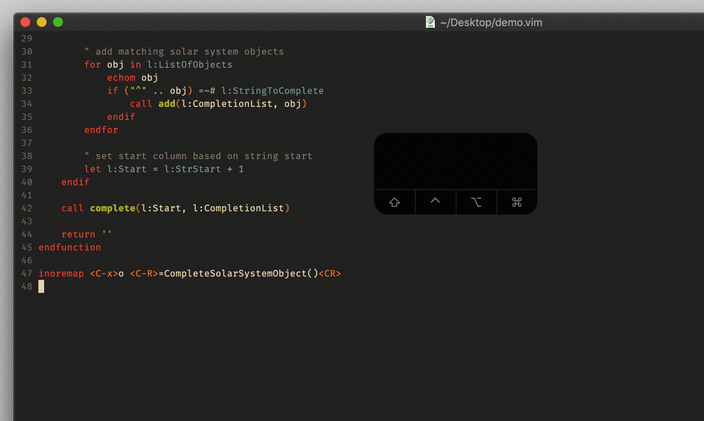

# function `complete`

## Vim Reference

    :help complete()

## Short Description
Simple custom insert mode completion.

## Examples

### Basics

Following the example from the Vim help we can see how to use this function. We wrap it with another function that we
trigger with a key mapping. The first parameter to `complete()` is the column in which we want to start the completion,
and for that we simply take the column of the current cursor position `col('.')`. If we use a column smaller than the
current cursor position column then all the text between the start column and the current cursor column will be deleted.
The second parameter is a list of strings we want to complete from. The insert mode completion is done by using the eval
register `=`.

    function! WrapperFunction()
        call complete(col('.'), ["foobar", "super", "trouper"])
        return ''
    endfunction

    inoremap <C-x>x <C-R>=WrapperFunction()<CR>

### Insert Time Stamps

Let's repeat this but with something more useful, like inserting time stamps in various formats.
We build the time stamp strings using the `strftime()` function.

    function! InsertTimeStamp()
        call complete(col('.'), [strftime("%Y-%m-%d"), strftime("%Y-%m-%dT%H:%M"), strftime("%d. %B %Y"), strftime("%H:%M")])
        return ''
    endfunction

    inoremap <C-x>t <C-R>=InsertTimeStamp()<CR>

### Advanced Example

As we learned before, providing a start column lower than the current cursor position column results in text deletion
between these two positions. Let's see how we can make use of that when we want to complete words we already started
typing. For that we have to find the beginning of the *word* or *WORD* we want to complete. We also will create the list
of possible completions dynamically. Let's say we want to complete from a list of solar system objects like planets and
moons.

	function! CompleteSolarSystemObject()

		" list of 190 solar system objects
		let l:ListOfObjects = ["Adrastea", "Aegir", "Aitne", "Albiorix", "Amalthea", "Ananke", "Anthe", "Aoede", "Arche", "Ariel", "Atlas", "Autonoe", "Bebhionn", "Belinda", "Bergelmir", "Bestla", "Bianca", "Caliban", "Callirrhoe", "Callisto", "Calypso", "Carme", "Carpo", "Chaldene", "Charon", "Cordelia", "Cressida", "Cupid", "Cyllene", "Daphnis", "Deimos", "Desdemona", "Despina", "Dione", "Dysnomia", "Earth", "Elara", "Enceladus", "Epimetheus", "Erinome", "Eris", "Erriapo", "Euanthe", "Eukelade", "Euporie", "Europa", "Eurydome", "Farbauti", "Fenrir", "Ferdinand", "Fornjot", "Francisco", "Galatea", "Ganymede", "Greip", "Halimede", "Harpalyke", "Hati", "Haumea", "Hegemone", "Helene", "Helike", "Hermippe", "Hi'iaka", "Himalia", "Hydra", "Hyperion", "Hyrokkin", "Iapetus", "Ijiraq", "Io", "Iocaste", "Isonone", "Janus", "Jarnsaxa", "Juliet", "Jupiter", "Kale", "Kallichore", "Kalyke", "Kari", "Kerberos", "Kiviuq", "Kore", "Laomedeia", "Larissa", "Leda", "Loge", "Lysithea", "Mab", "Magaclite", "Margaret", "Mars", "Mercury", "Methone", "Metis", "Mimas", "Miranda", "Mneme", "Moon", "Mundilfari", "Naiad", "Namaka", "Narvi", "Neptune", "Nereid", "Neso", "Nix", "Oberon", "Ophelia", "Orthosie", "Paaliaq", "Pallene", "Pan", "Pandora", "Pasiphae", "Pasithee", "Perdita", "Phobos", "Phoebe", "Pluto", "Polydeuces", "Portia", "Praxidike", "Prometheus", "Prospero", "Proteus", "Psamathe", "Puck", "Rhea", "Rosalind", "S/2000_J11", "S/2003_J_23", "S/2003_J10", "S/2003_J12", "S/2003_J15", "S/2003_J16", "S/2003_J17", "S/2003_J18", "S/2003_J19", "S/2003_J2", "S/2003_J3", "S/2003_J4", "S/2003_J5", "S/2003_J9", "S/2004_N_1", "S/2004_S07", "S/2004_S12", "S/2004_S13", "S/2004_S17", "S/2006_S1", "S/2006_S3", "S/2007_S2", "S/2007_S3", "S/2010_J_1", "S/2010_J_2", "S/2011_J_1", "S/2011_J_2", "Sao", "Saturn", "Setebos", "Siarnaq", "Sinope", "Skathi", "Skoll", "Sponde", "Stephano", "Styx", "Surtur", "Suttungr", "Sycorax", "Tarqeq", "Tarvos", "Taygete", "Telesto", "Tethys", "Thalassa", "Thebe", "Thelxinoe", "Themisto", "Thrymr", "Thyone", "Titan", "Titania", "Trinculo", "Triton", "Umbriel", "Uranus", "Venus", "Ymir"]
		let l:CompletionList = []

		" get current line as string
		let l:Line = getline('.')

		" Info: Strings start at 0, columns at 1

		" check the character before cursor 
		let l:Start    = col('.')
		let l:StrEnd   = col('.') - 1
		let l:StrStart = col('.') - 1
		if (l:Line[l:StrEnd-1] == ' ') || (l:StrEnd == 0)
			" no character before cursor, therefore no text before cursor, therefore complete from full list
			let l:CompletionList = l:ListOfObjects
		else
			" find start of word before cursor
			while (l:StrStart > 0) && (l:Line[l:StrStart - 1] =~ '\S')
				let l:StrStart -= 1
			endwhile
			" get string before cursor
			let l:StringToComplete = strpart(l:Line, l:StrStart, l:StrEnd-l:StrStart)

			" add word to complete to avoid loosing it (could be removed)
			call add(l:CompletionList, l:StringToComplete)

			" add matching solar system objects
			for obj in l:ListOfObjects
				echom obj
				if ("^" .. obj) =~# l:StringToComplete
					call add(l:CompletionList, obj)
				endif
			endfor

			" set start column based on string start
			let l:Start = l:StrStart + 1
		endif

		call complete(l:Start, l:CompletionList)

		return ''
	endfunction

	inoremap <C-x>o <C-R>=CompleteSolarSystemObject()<CR>

> Be aware that Vim has another completion "system" (`:h complete-functions`).
