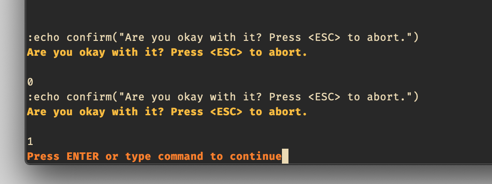
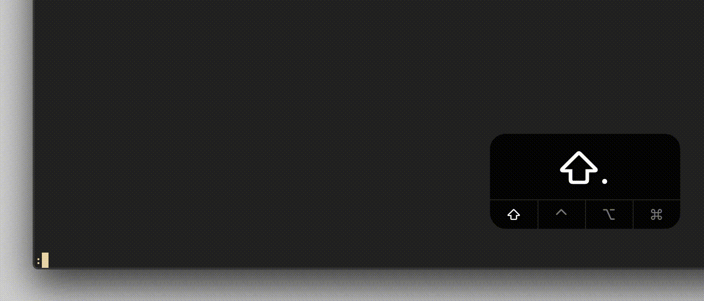
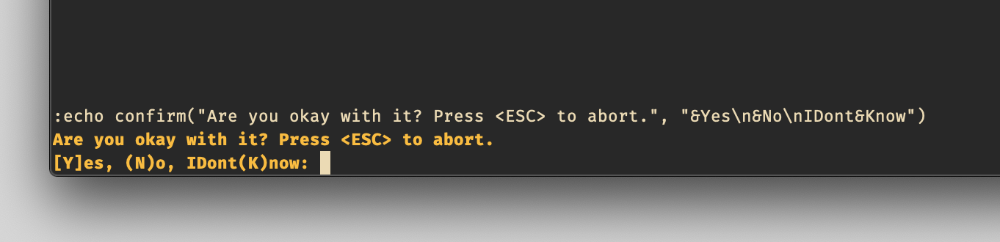
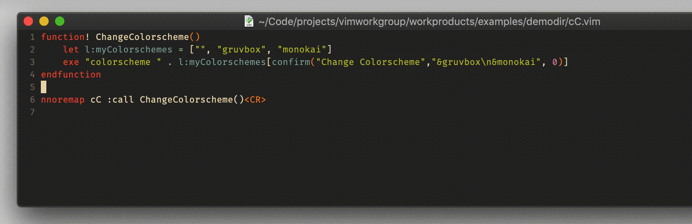

# function `confirm`

## Vim Reference

    :help confirm()

## Short Description
Print a choice dialog to select an element from.

## Examples
First let's have a look at a very simple example to understand the parameters that you have to pass to the function.
We add more or change parameters with every example.

### The Bare Minimum

To make this function work we just need to give the message that shall be displayed to the user. Vim will automatically
set "&Ok" as the only choice to select from, but the users can also press Escape to abort without making a selection. So
it's actually like having 2 choices already. The `confirm()` function returns the number (starting from 1) of the
element the user selected, and 0 when the user aborted by pressing `<ESC>`. So in the following example we have
accordingly only 0 and 1 as the possible return values. Let's print them and check if this works.

    :echo confirm("Are you okay with it? Press <ESC> to abort.")

As you can see we get the 0 when hitting *<ESC>* and 1 when hitting `o`.
Of course instead of printing/echoing the return value you would have to store it or use it to
decide what to do with the users selection.

    let UserSelection = confirm("Are you okay with it? Press <ESC> to abort.")

### Providing Choices to the User

In this next example we add some elements to choose from. The elements have to be separated with `\n` and when the `&` is
put in front of a character then this character will be used as the shortcut for this element.

    :echo confirm("Are you okay with it? Press <ESC> to abort.", "&Yes\n&No\nIDont&Know")

As you can see the shortcut characters are surrounded by either `()` or `[]`. The square brackets are used to show which
one is the default value, means what the user selects if the enter key is pressed.

### Changing the Default Value

We can also change the default value, so that the user can simply hit the Enter key for the most used element.
You can also set the default value to 0, which is the aborting with `<ESC>` behaviour.

    :echo confirm("Are you okay with it? Press <ESC> to abort.", "&Yes\n&No\nIDont&Know", 3)

### An Example Application

I posted my first personal application idea online at [vimrcfu](https://vimrcfu.com/snippet/105).

Let's write a new one just to have one more example. For example changing the colorscheme. If it makes sense - that's a
different story.

    function! ChangeColorscheme()
        let l:myColorschemes = ["", "gruvbox", "monokai"]
        let l:c=0
        let l:c = confirm("Change Colorscheme","&gruvbox\n&monokai", 0)
        exe "colorscheme " . l:myColorschemes[l:c]
    endfunction

    nnoremap cC :call ChangeColorscheme()<CR>

If the user hits Enter then 0 will be used, because I set 0 to be the default value. The 0th element in the
`l:myColorschemes` list is the empty string `""`, which means you are basically only executing `:exe "colorscheme"`
which only prints the current active colorscheme. If the user selects `g` or `m` for *gruvbox* or *monokai*, then the
string will be concatenated accordingly.

We can do it also without storing the choice in the intermediate variable `l:c`.

    function! ChangeColorscheme()
        let l:myColorschemes = ["", "gruvbox", "monokai"]
        exe "colorscheme " . l:myColorschemes[confirm("Change Colorscheme","&gruvbox\n&monokai", 0)]
    endfunction

    nnoremap cC :call ChangeColorscheme()<CR>

