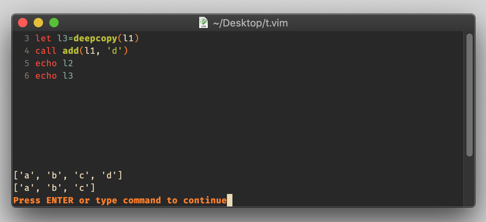

# function `deepcopy()`

## Vim Reference

    :help deepcopy()
    :help copy()

## Short Description
Create a copy of the given expression.

## Example

In the following example I will use a list as a demo object. There you can see how the assignment is only copying the
list reference, but `deepcopy()` creates an actual copy. We are chaning `l1` by adding a new element, and `l2` is
affected because the reference has been copied, and `l3` is a new list and therefore not affected by the change.

    let l1=['a', 'b', 'c']
    let l2=l1
    let l3=deepcopy(l1)
    call add(l1, 'd')
    echo l2
    echo l3

