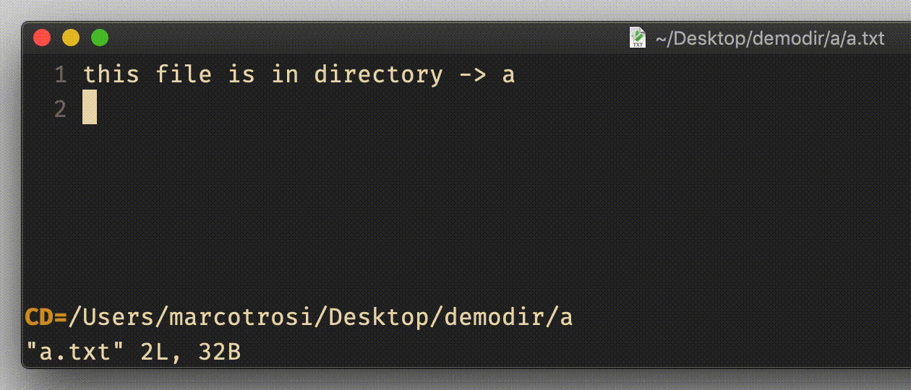

# option `autochdir`

## Vim Reference

    :help 'autochdir'

## Short Description
Automatically change working directory to the directory path of the currently open file.

## Example

If you put this in your vimrc ...

    set autochdir

... the working directory will change automatically.

In this example I have 3 files open which are placed in different directories (a, b and c).
Look at the statusline (bottom of window) how the working directory changes automatically after I set `autochdir`.

> There might be situations where this option might come in handy, but I think that in most project based editing you
> need a fix working directory, which is probably the root of your project. You start searching files from there, and
> you grep and you might have .tags file placed there as well that Vim has to find. If you have to switch directory to
> the location of the currently open file, then you can create for example the following mapping and trigger the
> directory change manually whenever you need it. Luckily `cd` is free for your own mapping and also a nice mnemonic for `change directory`.

    nnoremap cd :cd %:p:h<CR>
    
