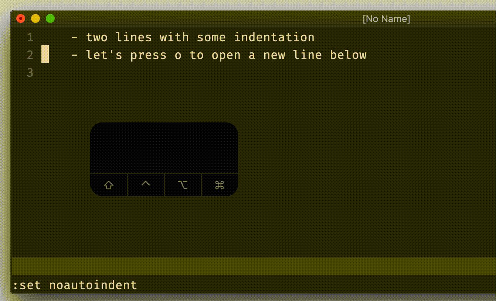

# option `autoindent`

## Vim Reference

    :help 'autoindent'

## Short Description
Copy indent from current line when starting a new line.

## Example

Pretty self-explanatory ...

> Be aware that `autoindent` is somehow connected to `smartindent` and `cindent`.

