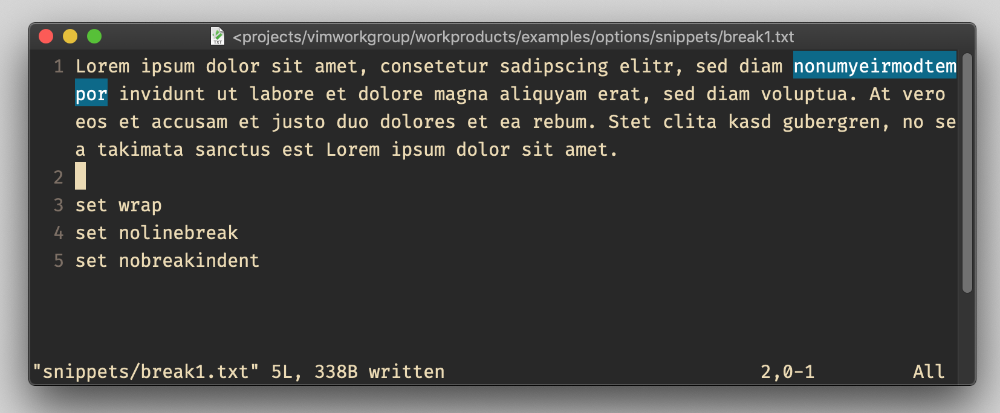
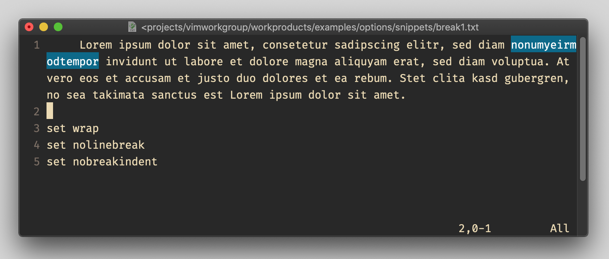
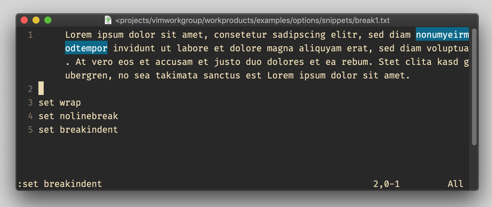
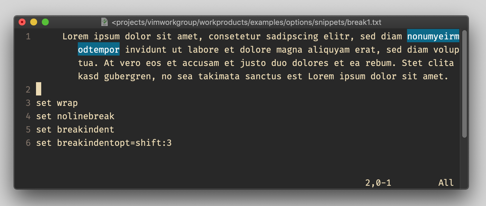
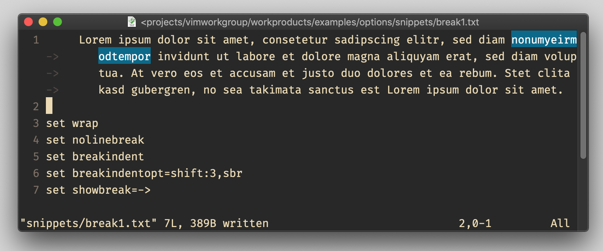
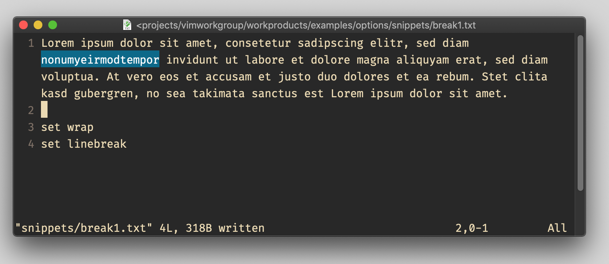
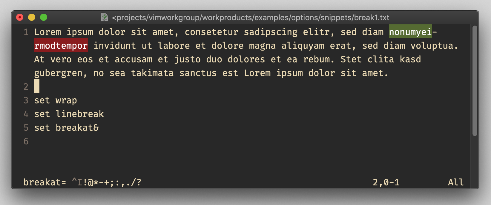

# options `breakat`, `breakindent`, `breakindentopt`

## Vim Reference

    :help 'breakat'
    :help 'breakindent'
    :help 'breakindentopt'
    :help 'linebreak'
    :help 'wrap'
    :help 'showbreak'

## Short Description
Control behavior when breaking/wrapping long lines.

## Examples
At a different page I will explain more on how to handle long lines. I will try to focus here on these 3 options.
But some options are a prerequisite to make them work. I used a *"Lorem Ipsum"* text and I removed some spaces to create a
long word which I highlighted.

### Wrapping lines at right screen end

When we have set ...

    set wrap
    set nolinebreak
    set nobreakindent

... in our *.vimrc* then you should get something like in the following image. You can see that the highlighted word
gets broken just where the screen ends. It doesn't pay attention to the word.

### Wrapping indented lines

Indenting the line with the same settings will look like this ...

But if we turn on `breakindent` then it will indent also the wrapped lines with the same width as the line is indented.

    set breakindent

### Indent wrapped lines

We can also indent the wrapped lines additionally by a given width by setting ...

    set breakindent=shift:3

### Displaying wrapped lines indicators

We can also let Vim print some characters of choice to indicate wrapped lines by adding the `sbr` value to
`breakindentopt` and specifying the characters to be displayed in the `showbreak` option. In this example I used `->`
and you can see them on the left side with a middle grey color in front of each wrapped line continuation.

    set breakindentopt=sbr
    set showbreak=->

### Respecting word boundaries when wrapping lines

So far Vim just broke the lines at the right screen border and fully ignoring where a word starts and ends.
This can be changed with the `linebreak` option.

    set linebreak

You can see how the long word is now kept in the same line.

But actually it's not only whitespaces where Vim breaks the lines, it's a list of characters that Vim uses to break the
lines. These character is list can be found in the `breakat` option.
To see the default values of `breakat` run ...

    set breakat

To reset the `breakat` option to default use ...

    set breakat&

In the following example I added a dash in our long word and you can see that Vim breaks the line there, because the
dash is part of the `breakat` character list. At the bottom of the screenshot I printed the default value for you.

