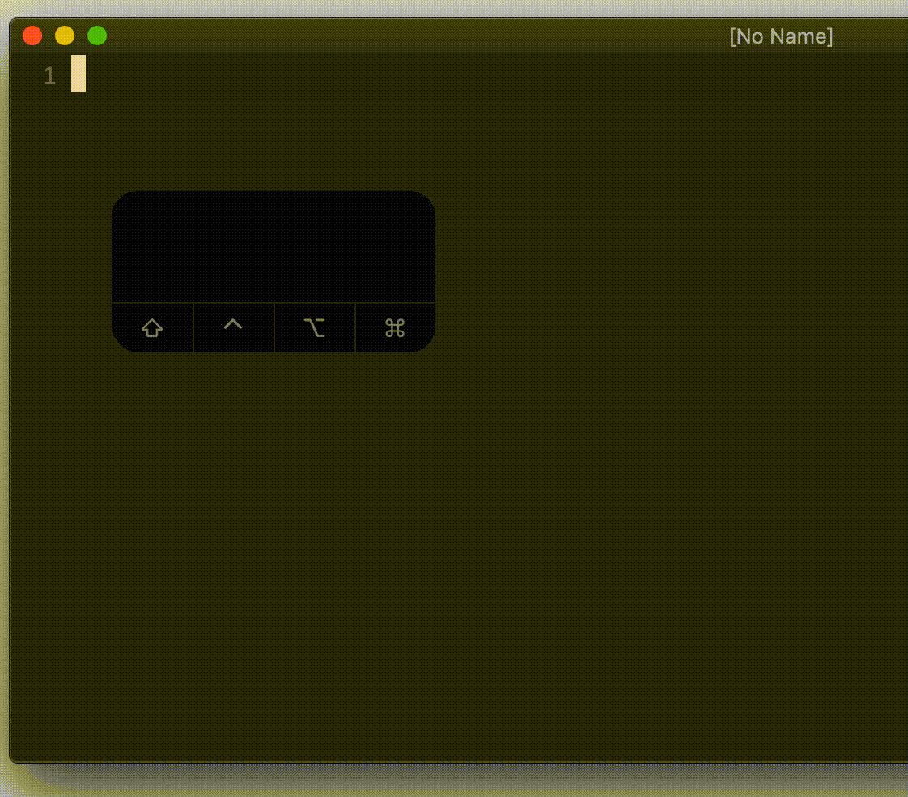

# option `cedit`

## Vim Reference

    :help 'cedit'
    :help c_CTRL-F
    :help q:
    :help q/
    :help q?

## Short Description
Change key to open the commandline-window from the commandline.

## Example
The default key for opening the commandline-window from the commandline is `<C-f>`.
If we want to change the key to another one, then we have to use the following method.
In this example I will use `Ctrl-o`, because it's a not-used key in the commandline.

		exe "set cedit=\<C-o>"

Having that line in your *.vimrc* allows you then to use `Ctrl-o` instead of `Ctrl-f`.

