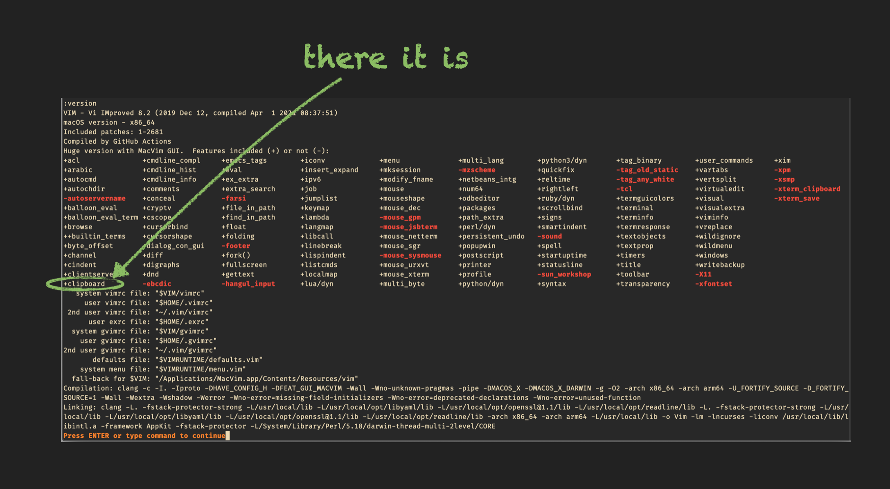

# option `clipboard`

## Vim Reference

    :help 'clipboard'
    :help clipboard
    :help +clipboard
    :help +xterm_clipboard
    :help quotestar

## Short Description

Option to configure the clipboard behaviour.

## Example

I will mention only one setting, for the rest I want to encourage you to read the Vim help, and that's the famous
`"unnamed"` value that can be assigned to `'clipboard'`. One of the first issues beginners come across is the clipboard
handling, because it is different than you know from any other editor.

Your Vim must be compiled with clipboard support. You can check this by running the `:version` command, and search for
`+clipboard`. If you see `-clipboard` then you don't have that support.

When your `'clipboard'` option is empty, then your OS clipboard is connected to your `*` register.
This means you have to use `"*y`/`"*p` to copy/paste to/from it.

But some people find that annoying and prefer to be able to directly interact with the OS clipboard by using the `y`/`p`
commands without specifying the `*` register. Your solution is ...

    set clipboard=unnamed

... and now your OS clipboard is connected to the *unnamed* register `"` and you can use `y`/`p` to access your clipboard.

