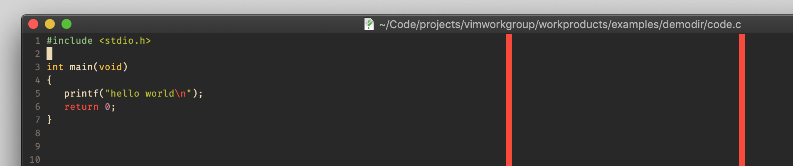
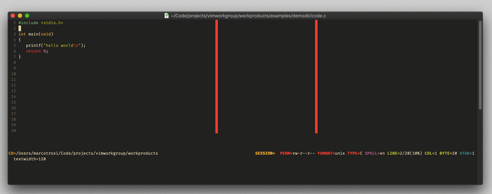

# option `colorcolumn`

## Vim Reference

    :help 'colorcolumn'
    :help 'textwidth'
    :help hl-ColorColumn

## Short Description
A comma separated list of screen columns that are highlighted.

## Examples
You can highlight columns by absolute values and relative to the `'textwidth'` option.

    set textwidth=120
    set colorcolumn=80,+0

In this example we highlight column 80 with and an absolute value and the column 120 given in textwidth using a relative
value, because 120 + 0 is 120. And if you don't like the color your colorscheme has set, then you can change it either
in your colorscheme vim file, or after loading the colorscheme in your `.vimrc`.

    hi ColorColumn guibg=#FB4934

Setting `'colorcolumn'` to nothing turns it off again.

    set colorcolumn=

And here a little demo that shows how I change the `'textwidth'` value and the relative column moves with it.
You can see the values at the bottom left corner.

