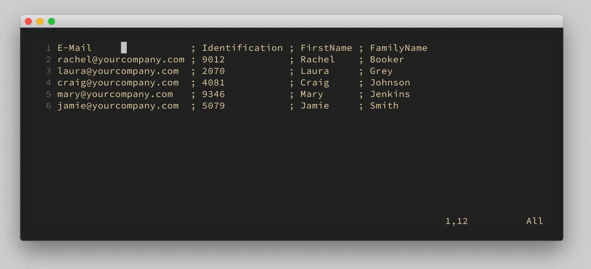
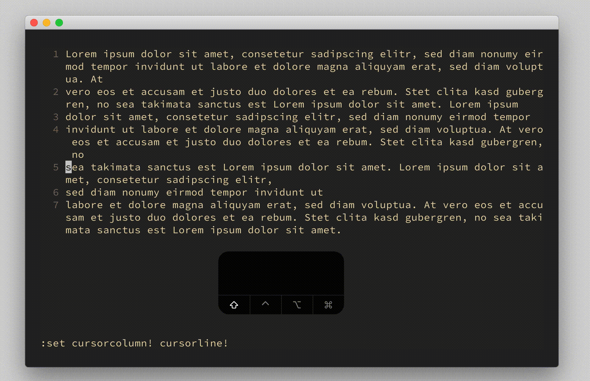

# options `cursorcolumn`, `cursorline`, `cursorlineopt`

## Vim Reference

    :help 'cursorcolumn'
    :help 'cursorline'
    :help 'cursorlineopt'
    :help hl-CursorColumn
    :help hl-CursorLine
    :help hl-CursorLineNr

## Short Description
Highlight line and column of current cursor position.

## Examples

### Turn on highlight for column and line

If you need a little visual guidance you can turn on one of them or both. This can be useful to spot
your cursor faster or when dealing with aligned data, like in a CSV file, to check if text is in the
same column or to avoid accidental line shifts when finding data in long lines.

    set cursorcolumn
    set cursorline

### Change highlight for wrapped lines

The `'cursorlineopt'` allows you to turn the highlight of the line number
on/off, and you can specify if a long wrapped line is highlighted as one or the
individual wrapped lines. The default is "number,line" and let's see what
happens when we change it to "screenline".

As you can see with "line" the whole line is highlighted as it is in the file,
and with "screenline" the line is highlighted as it is on screen. Of course you can also set "number,screenline".

