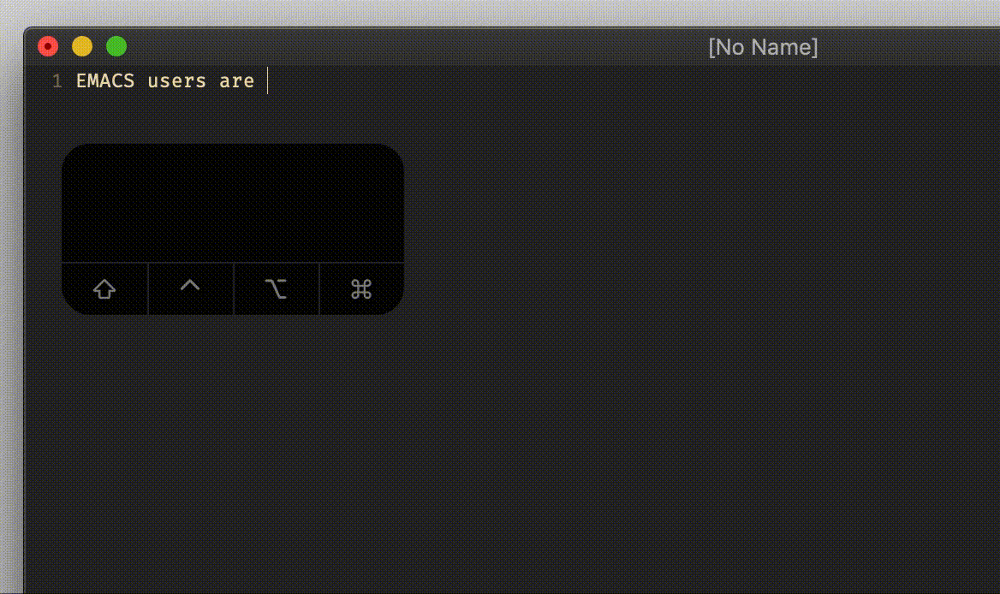

# option `dictionary`

## Vim Reference

    :help 'dictionary'
    :help i_CTRL-X_CTRL-K

## Short Description
Set comma separated list of dictionary files.

## Example

On my system I have a dictionary file at `/usr/share/dict/words`, and I want to use it in Vim.
So I set the path accordingly.

    set dictionary=/usr/share/dict/words

Now I can complete from that dictionary using the insert mode command `<C-x><C-k>`.

