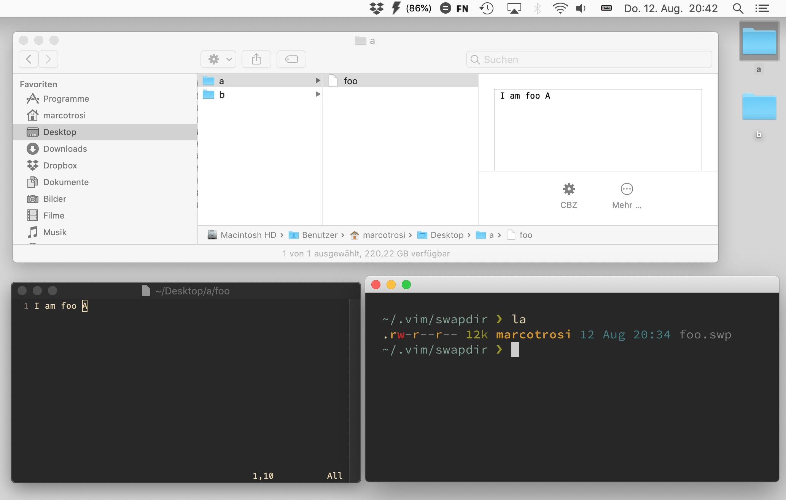
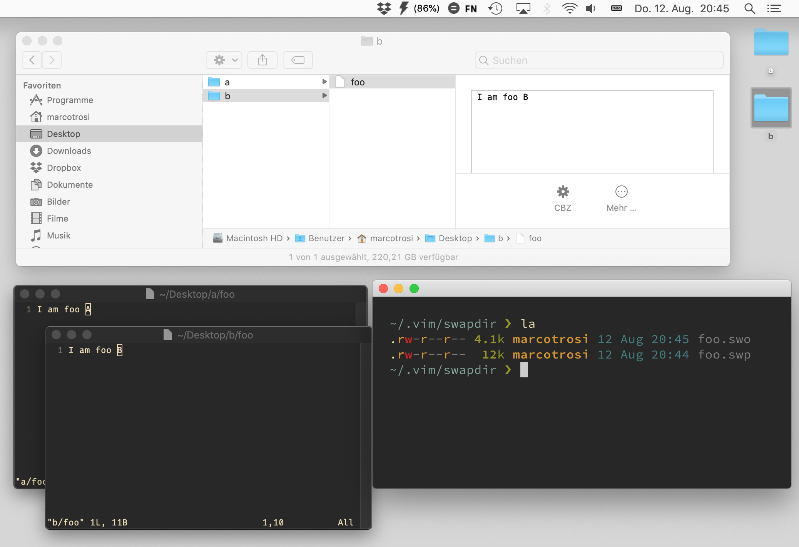
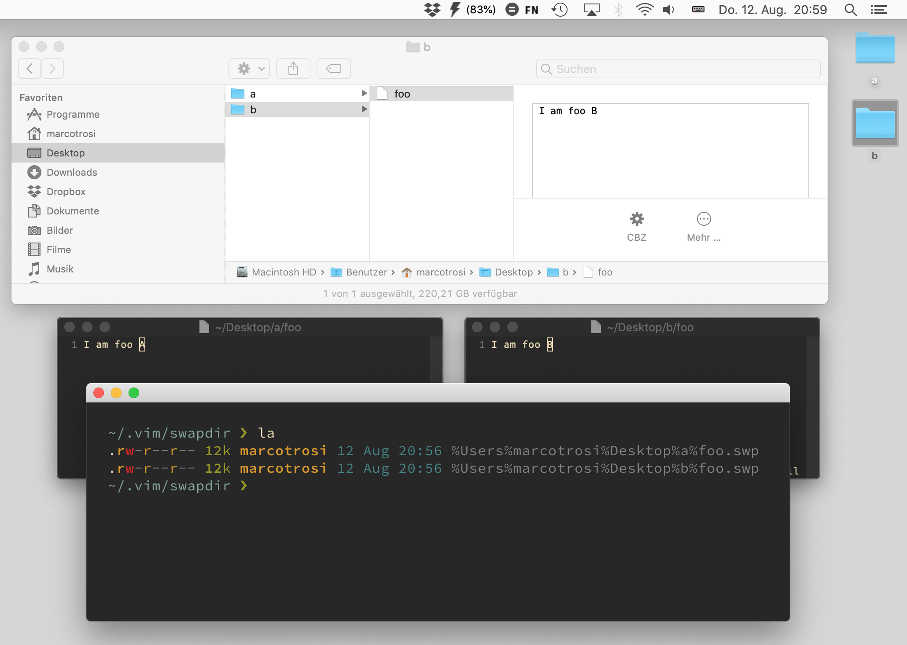

# option `directory`

## Vim Reference

    :help 'directory'
    :help 'swapfile'

## Short Description
List of directory names for the swap file.

## Example

This option accepts a comma separated list of directories, so that if one is not available then Vim takes the next one from
the list. In this example we use only one directory for simplicity.

If you don't like the default value for `directory` then you can overwrite in your *vimrc*. For example I don't like
having the `.` in the list, which means "directory of the file currently being edited", because when I copy for example
my project folder while a file is still open in Vim, then I copy the swap file too.
So let's put the swap files into a self-created directory or `/tmp` only.

    set directory=~/.vim/swapdir

Now let's open a file named `"foo"` that is located on my Desktop inside a folder named `"a"`. We will see soon why this
is relevant.

So Vim creates a swap file in the configured directory named `"foo.swp"`.
But what happens if we open another file with the same name, in a second Vim instance? For sure the swap file can't have
the same name.

As you can see the file extension changes and the swap file is named `"foo.swo"`. But we don't know which swap file belongs
to which `"foo"` file. And this can be fixed by adding a double slash after the directory name.

    set directory=~/.vim/swapdir//

And now Vim takes the absolute paths of the files and builds a filename for the swap file by replacing the slashes with
the percentage % character.

