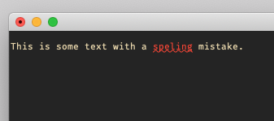
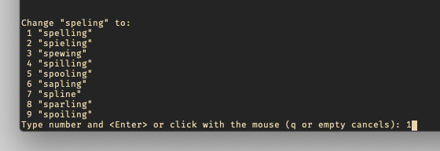
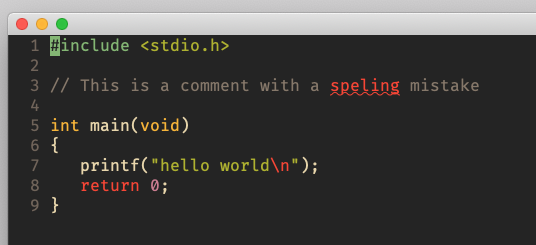
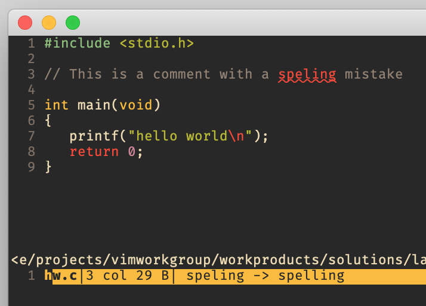

# Spell Checking
You can find some spell checker plugins for Vim online, but they are from a time when Vim had no built-in spell checker.
This feature has been added with version 7 dot something and this is what we will address here.

## Basic Commands and Settings

Vim has a spell checker built in. If you want to activate it simply run ...

    :set spell

If you have some misspelled words, then you probably see them with some curly underline.

Vim has the following commands to cycle through all misspelled words.

+ `]s` move to next misspelled word
+ `[s` move to previous misspelled word

But Vim can also help you to correct the misspelled words.

+ `z=` suggest correctly spelled words for the word under/after the cursor

You should see at the bottom a list of spelling corrections. Just enter the
number of the word you want to select and hit enter.

If you don't write English and you want to check your text in different
language, then you can configure that.

    :set spelllang=de

You can even set multiple languages.

    :set spelllang=en,it

If you set `spelllang` to a language for which you don't have a spell file yet,
then Vim will try to download it.

    :set spelllang=es

For more information on things like 'adding words as good/bad spelled' or
'spelling settings' read ...

[:help spell](https://vimhelp.org/spell.txt.html)

There is really much more to know about, but I don't want to clone the Vim help.

## Spell Functions
Vim also has functions for the spelling topic. As of today it's `spellbadword()` and `spellsuggest()`.

    :help spellbadword()
    :help spellsuggest()

I'd like to talk about `spellbadword()` here. This function finds misspelled words, but it also has some peculiarities,
which you should know and which make the usage of this function unnecessarily annoying.

+ It can be used either without argument, which in this case finds the first misspelled word from cursor position until
  end of line, and puts the cursor on the beginning of the misspelled word.
+ Or you provide a string, in which it finds the first misspelled word.

`spellbadword()` returns independent of how you called it and independent of finding a misspelled word or not, in any case a list with 2 entries.
The first entry is the misspelled word and the second entry is the type. The following types exist ...

+ "bad" -> spelling mistake
+ "rare" -> rare word
+ "local" -> word only valid in another region
+ "caps" -> word should start with Capital

If no misspelled word was found then the returned list is `['','']`.

So you notice we get only the first misspelled word and no line or column information. But if we want to write a plugin
or a helper function we need to have a full list of misspelled words and their locations. Sadly we have to implement
that ourselves. We will start with providing the single words to `spellbadword()`, because I want to point out a problem
that comes with that solution, and which leads to the second implementation.

	function! GetMisspelledWords() abort
		let l:LineCnt  = 0
		let l:BufLines = getbufline('%', 1, '$')
		let l:BadWords = []
		for line in l:BufLines
			let l:Start=0
			let l:LineCnt = l:LineCnt + 1
			while v:true
				let l:Match = matchstrpos(line,'\a\+',l:Start)
				if l:Match[0] == ''
					break
				else
					let l:Word  = l:Match[0]
					let l:Start = l:Match[1]
					let l:End   = l:Match[2]
					let l:Check = spellbadword(l:Word)
					if l:Check[0] != ''
						let l:Result = {}
						let l:Result['word']     = l:Check[0]
						let l:Result['type']     = l:Check[1]
						let l:Result['bufname']  = bufname('%')
						let l:Result['filename'] = expand('%:p')
						let l:Result['bufnr']    = bufnr('%')
						let l:Result['line']     = l:LineCnt
						let l:Result['scol']     = l:Start+1
						let l:Result['ecol']     = l:End
						call add(l:BadWords, l:Result)
					end
					let l:Start = l:End
				endif
			endwhile
		endfor
		return l:BadWords
	endfunction

Okay let's test it. We take the following "hello world" C file for testing, which has a misspelled word in the comment.

	 #include <stdio.h>

	 // This is a comment with a speling mistake

	 int main(void)
	 {
		  printf("hello world\n");
		  return 0;
	 }

We run the function for now with ...

    :echo GetMisspelledWords()

... and we can see the echo at the bottom that says that the words 'h', 'speling', 'printf' and 'n' have a spelling error.
But if we look at the undercurled lines in Vim, there we see only a single word misspelled. What is going on here?

So of course when we provide a word to the `spellbadword()` function that is not known then it must be marked as
spelling mistake. From that point of view nothing is wrong. But on the other hand this can be very annyoing in source
code and obviously we can tell from the screenshot above that Vim is capable of handling it in a smart way, so that only
the really misspelled word is listed and not the irrelevant parts of the source code. And this leads us to the second
implementation that calls `spellbadword()` without argument. Because this way Vim is taking care of the source code and
it will find only the misspelled word.

	function! GetMisspelledWords() abort
		let l:LineCnt  = 0
		let l:BufLines = getbufline('%', 1, '$')
		let l:BadWords = []
		for line in l:BufLines
			let l:Start=0
			let l:LineCnt = l:LineCnt + 1
			while v:true
				call cursor(l:LineCnt, l:Start+1)
				let l:CursorPos = getpos('.')
				if l:CursorPos[2] != l:Start+1
					break
				end
				let l:Check = spellbadword()
				if l:Check[0] != ''
					let l:Result = {}
					let l:Result['word']  = l:Check[0]
					let l:Result['type']  = toupper(l:Check[1][0])
					let l:Result['bufnr'] = bufnr('%')
					let l:CursorPos       = getpos('.')
					let l:Result['lnum']  = l:LineCnt
					let l:Start           = l:CursorPos[2]
					let l:Result['scol']  = l:Start
					let l:End             = l:Start + strdisplaywidth(l:Check[0]) - 1
					let l:Result['ecol']  = l:End
					let l:Result['sugg']  = spellsuggest(l:Check[0], 1)[0]
					call add(l:BadWords, l:Result)
					let l:Start = l:End
				else
					break
				end
			endwhile
		endfor
		return l:BadWords
	endfunction

If we repeat the test with the new implementation we can see it gives the same result as the highlighting shows.
The problem with the Vim default solution is that you only see the spelling errors in the buffer. You don't get a list
that only contains the errors. If we now combine our new function with the quickfix list, we should be able to create a
powerful spelling error handling solution. Let's try.

	function! QuickfixMisspelledWords() abort
		let l:QFList = []
		let l:Words = GetMisspelledWords()
		for word in l:Words
			call add(l:QFList, {'bufnr':word['bufnr'], 'lnum':word['lnum'], 'col':word['scol'], 'type':word['type'], 'text':word['word'] .. ' -> ' .. word['sugg']})
		endfor
		call setqflist(l:QFList)
		copen
	endfunction

When we call this new function then we should get a quickfix list with all misspelled words and the first correction
suggestion that Vim would do if we would execute the `1z=` command.

As we now have every misspelled word in that quickfix list, we even can now check if the suggestions is what we want and
then fix all spelling errors with one command.

    :cdo normal 1z=

Not so bad. With just 2 fairly small functions we were able to achieve such powerful feature.
Of course from here you can add more features like changing directly from the quickfix list, creating mappings etc.

