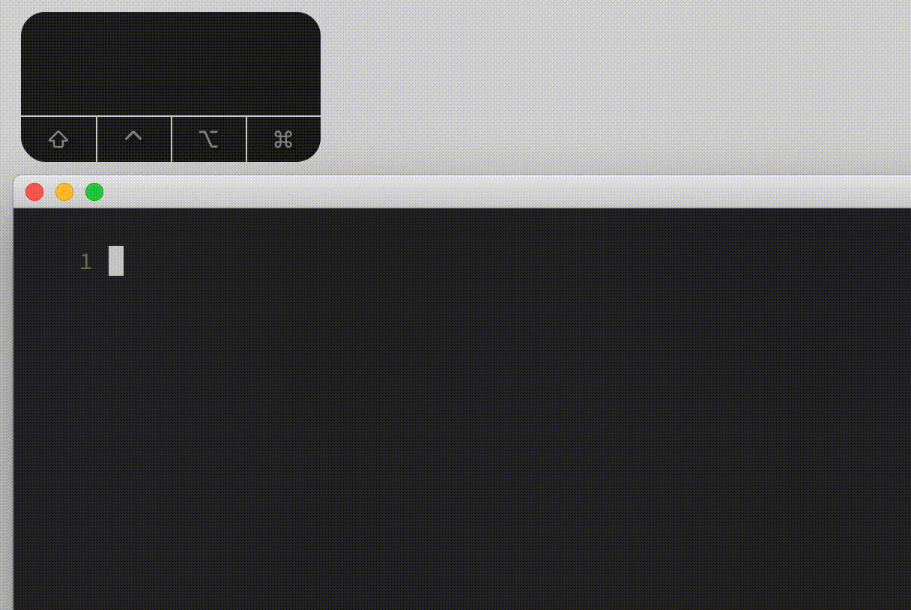
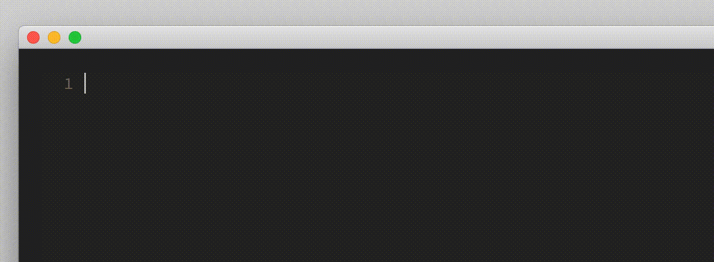

# Table Of Content

- Basic Text Completion
	- Configuration
		- `set complete`
		- `set completeopt`
			- completeopt empty
			- menu
			- menuone
			- longest
			- noselect
- Advanced Text Completion
	- From Current File
	- From Dictionary
	- From Thesaurus
	- From Spelling Suggestions
	- From Whole Lines
	- From File And Directory Names
	- From Vim Commands
	- User Defined Completion
		- The Basics
		- The Practical Example
- complete() - the alternative user completion

# Text Completion

A pretty essential editor feature is text completion. Of course Vim has that too, and in this chapter we will see what Vim
can do for you.

## Basic Text Completion

Let's assume you have written somewhere in your buffer the word "supercalifragilisticexpialidocious", and now you have
to write that word again at a different location in your text. Surely we want to avoid typing errors and typing such a
long word is annoying, so we could copy-paste it but there is a better way.

For example you could start typing "super" and then while still in insert mode you can press `<C-n>` (next match) or
`<C-p>` (previous match) and Vim will show you all words in your text that start with "super". From that list you can
select the word you need by continuously pressing `<C-n>` or `<C-p>` and then you either press `<C-e>` to cancel the
completion, or you press `<C-y>` to confirm your selection, or you simply continue typing. When there is only one word
that matches then you get the completion without a list.

### Configuration

#### `set complete`

This completion is configurable and we will learn now what can be configured. The first option we should have a look at
is "complete". This option is used to tell Vim where to search for matching words for your completion. For example if
you want Vim to complete only from words of the current buffer then you can set ...

    set complete=.

The default value is "`.,w,b,u,t,i`". Below is a list of values that you can use as a comma separated list.

+ `.` scan the current buffer
+ `w` scan buffers from other windows
+ `b` scan other loaded buffers that are in the buffer list
+ `u` scan the unloaded buffers that are in the buffer list
+ `U` scan the buffers that are not in the buffer list
+ `k` scan the files given with the 'dictionary' option
+ `kspell` use the currently active spell checking
+ `k{dict}` scan the file {dict}
+ `s` scan the files given with the 'thesaurus' option
+ `s{tsr}` scan the file {tsr}
+ `i` scan current and included files
+ `d` scan current and included files for defined name or macro
+ `t` tag completion

For more information read ...

    :help 'complete'

#### `set completeopt`

The next option we talk about is called `completeopt`. With this option we can configure how the completion popup menu
shall behave.

+ `menu`        use a popup menu
+ `menuone`     use a popup menu also when there is only one match
+ `longest`     only insert the longest common text of the matches
+ `preview`     show extra information in preview window
+ `popup`       show extra information in popup window
+ `popuphidden` like "popup" but initially hide the popup
+ `noinsert`    do not insert any text
+ `noselect`    do not select a match

For more information read ...

    :help 'completeopt'

It is a bit tedious to figure out what these options are doing exactly, so I thought I provide some GIFs that show what
they are doing. Every example will have a list of words in the beginning that I use for completion.

##### completeopt empty

We start with an empty list.

    set completeopt=

##### menu

For the next we need 2 GIFs. One with multiple matches, and one with one match only.

    set completeopt=menu

##### menuone

The next one behaves the same as "`menu`" when there are multiple matches, but also shows a menu when there is only one match.

    set completeopt=menuone

##### longest

The next option called "`longest`" we will use together with "`menu`" (or "`menuone`"), because in that combination it has one
more feature. When the menu pops up, then you can press `<C-l>` to insert the next character from the first list entry
and this can reduce the list further. But of course the main behavior is that it inserts on first press the common longest match.

    set completeopt=menu,longest

##### noselect

The last options we discuss here is "`noselect`", which doesn't complete anything at first when triggering the
completion. I was not able to make good use of "`noinsert`". Maybe someone else has a good use case that I'm missing.

    set completeopt=menu,noselect

##### preview, popup, popuphidden

`popuphidden` is for asynchronous completion, and for `preview` and `popup` I added 2 screenshots with explanation 
in the section below about user defined completion function.

## Advanced Text Completion

As you learned now, Vim can complete words from various sources like open files, dictionaries and many more. But this is
usually a setting in your vimrc and is therefore fix. So the basic text completion works with what has been configured
and you can not decide with `Ctrl-n/p` to complete now, in this very particular moment, only from e.g. the dictionary
and in the next moment from the current buffer. But Vim has more insert completions. These other insert completions are
all triggered with the key `<C-x>` followed by a second key that selects the source for the completion you want to
trigger. Once the completion popup is open you can iterate the completion proposals using `Ctrl-n` and `Ctrl-p`.
Here is an overview of the available insert mode completions.

+ CTRL-X_CTRL-N => keywords in the current file
+ CTRL-X_CTRL-K => keywords in 'dictionary'
+ CTRL-X_CTRL-T => keywords in 'thesaurus'
+ CTRL-X_CTRL-S => spelling suggestions
+ CTRL-X_CTRL-L => whole lines
+ CTRL-X_CTRL-F => file names
+ CTRL-X_CTRL-V => Vim command-line
+ CTRL-X_CTRL-U => user defined completion
+ CTRL-X_CTRL-I => keywords in the current and included files
+ CTRL-X_CTRL-D => definitions or macros
+ CTRL-X_CTRL-] => tags
+ CTRL-X_CTRL-O => omni completion

> The completions from included files, definitions, tags and omni completion will be explained in the language dependent chapters.

For more information read

    :h ins-completion

We will go now through these completion types and see how they work.

### From Current File

The first one, `<C-x><C-n>`, is like having set `set complete=.` and using `<C-n>`, it will only complete with words from your current
buffer.

### From Dictionary

`<C-x><C-k>` is used when you want to complete from dictionary. This of course depends on your dictionary setting.

    :help 'dictionary'
    :set dictionary?

### From Thesaurus

No, it's not a dinosaur. Thesaurus shows you words with the same or similar meaning (synonyms) or other ways of writing
it. It is triggered with `<C-x><C-t>`. But you need to have a thesaurus file and tell Vim where to find it.

    :help 'thesaurus'
    :set thesaurus?

In the help is a link to a GitHub comment with an attached ZIP file that contains a thesaurus file. I downloaded it, I
unpacked it, I created the folder `.vim/thesaurus`, and moved the `thesaurus.txt` file to that folder but renamed it to
`english.txt`, just in case I will have more such files for other languages. Then I have to tell Vim where it is.

    :set thesaurus=~/.vim/thesaurus/english.txt

Now let's check if it works. Assume you are writing a text, and you just wrote the word `uncanny`, but then you realize
you have used it already in the last sentence, which is sometimes a bad style and so you decide to replace it with a
similar word. So just keep your cursor right after the word in insert mode and press `<C-x><C-t>`, and you will get a
list of words to select from.

You can now even write your own thesaurus completion function. See ...

    :help 'thesaurusfunc'
    :help compl-thesaurusfunc

### From Spelling Suggestions

The situation is quite clear. You just wrote a word which contains a spelling error. While still in insert mode and the
cursor is right after the misspelled word (0 or more spaces between cursor and the misspelled word are allowed), just press
`<C-x><C-s>` (or `<C-x>s`) to get a list of words to select from. `set spell` is required for this to work.

### From Whole Lines

Vim can also complete full lines when you pres `<C-x><C-l>`. This can be useful in a programming scenario, where it is
more likely that lines start the same.

### From File And Directory Names

Now something really useful. Vim can complete names of files and directories when you press `<C-x><C-f>`.
This works with paths relative to the current working directory but also with absolute paths.

### From Vim Commands

Let's say you are writing a Vim script, then you can use `<C-x><C-v>` to complete Vim keywords. These are things like
Vim commands, settings, variables and functions.

### User Defined Completion

The user defined completion is triggered with `<C-x><C-u>`, and it's really what the name implies. You can write your
own completion function that does whatever you want.
I really recommend reading ...

    :help complete-functions

#### The Basics

The completion function gets called twice. On first call the text to be completed has to be found, and on second
call the list of possible matches have to be identified.
The structure of your function is as follows ...

    function! MyUserCompletion(findstart, base)
       if a:findstart
          let start = col('.') " init start
          " put code here to locate the start of the word
          return start
       else
          let res = [] " or {'words':[{},{},...,{}], 'refresh':'always'}
          " put code here to get the completion words
          call add(res, ...)
          return res
       endif
    endfunction
    
    set completefunc=MyUserCompletion

For the second invocation the return value, here called `res`, can have 2 different structures.
Either it's a flat list of matching strings ...

    let res = ['match1', 'match2', 'match3']

... or a dictionary that looks like this ...

    let res = {
                 'words':[
                           {'word':'match1'},
                           {'word':'match2'},
                           {'word':'match3'}
                         ],
                 'refresh':'always'
              }

Okay let's test both variants with some hard coded results. Let's start with the flat list.

    function! MyUserCompletion(findstart, base)
       if a:findstart
          let start = col('.')
          return start
       else
          let res = ['match1', 'match2', 'match3']
          return res
       endif
    endfunction
    set completefunc=MyUserCompletion

And here we now return a dictionary with a list of dictionaries instead of a flat list.

    function! MyUserCompletion(findstart, base)
       if a:findstart
          let start = col('.')
          return start
       else
          let res = {
    \                 'words':
    \                   [
    \                     {'word':'match1'},
    \                     {'word':'match2'},
    \                     {'word':'match3'},
    \                   ],
    \                 'refresh':'always'
    \               }
          return res
       endif
    endfunction
    set completefunc=MyUserCompletion

So why all that effort if they do the same? Because the dictionary has even more fields that allow
you to configure what to display in the popup. Let's have a look at the most important ones.

    function! MyUserCompletion(findstart, base)
       if a:findstart
          let start = col('.')
          return start
       else
          let res = {
    \                 'words':
    \                   [
    \                     {'word':'match1', 'kind':'a', 'abbr':'abbr1', 'menu':'menu1', 'info':'info1'},
    \                     {'word':'match2', 'kind':'b', 'abbr':'abbr2', 'menu':'menu2', 'info':'info2'},
    \                     {'word':'match3', 'kind':'c', 'abbr':'abbr3', 'menu':'menu3', 'info':'info3'},
    \                   ],
    \                 'refresh':'always'
    \               }
          return res
       endif
    endfunction
    set completefunc=MyUserCompletion

So the dictionary allows us to display all kinds of information. For example `kind` can be `f` for function when
completing source code. `abbr` is only the display text in the popup but `word` gets inserted. The `menu` info is
displayed along with all possible completion matches, and the `info` text is only displayed for the selected completion
match. And depending on your `completeopt` setting `info` is either displayed in a preview window
(`set completeopt=menu,preview`) or in a popup (`set completeopt=menu,popup`).

The preview window hight, and the popup can even be configured. For more information read ...

    :help complete-items
    :help complete-popup
    :help 'completepopup'
    :help 'previewheight'

#### The Practical Example

Now let's create an useful example by completing environment variable names and their value. The problem is that we
can have only one user completion function, and so we need to switch the completion function right before triggering it.
Means that instead of pressing `<C-x><C-u>` to trigger the user completion, we come up with another mapping that
switches the user completion function and then triggers `<C-x><C-u>` automatically.

    inoremap <C-g>e     <C-o>:set completefunc=CompleteEnvVarName<CR><C-x><C-u>
    inoremap <C-g><C-e> <C-o>:set completefunc=CompleteEnvVarValue<CR><C-x><C-u>

You can also use a global or script variable, assign a number or string and have only 1 user completion function that
depending on the value calls the desired completion function. I don't know which way is better.

    function! CompleteEnvVarName(findstart, base)
       if a:findstart
          let l:Line = getline('.')
          let l:CursorCol = col('.') - 1
          let l:FirstCharCol = l:CursorCol - 1
          while (l:FirstCharCol > 0) && (l:Line[l:FirstCharCol-1] =~ '\w')
             let l:FirstCharCol -= 1
          endwhile
          return l:FirstCharCol
       else
          let l:EnvVars = environ()
          let l:Matches = []
          for [key, value] in items(l:EnvVars)
             if match(key, '^' . a:base) != -1
                call add(l:Matches, {'word':key, 'abbr':key, 'menu':value})
             endif
          endfor
          return {'words':l:Matches, 'refresh':'always'}
       endif
    endfunction
    
    function! CompleteEnvVarValue(findstart, base)
       if a:findstart
          let l:Line = getline('.')
          let l:CursorCol = col('.') - 1
          let l:FirstCharCol = l:CursorCol - 1
          while (l:FirstCharCol > 0) && (l:Line[l:FirstCharCol-1] =~ '\w')
             let l:FirstCharCol -= 1
          endwhile
          return l:FirstCharCol
       else
          let l:EnvVars = environ()
          let l:Matches = []
          for [key, value] in items(l:EnvVars)
             if match(key, '^' . a:base) != -1
                call add(l:Matches, {'word':value, 'abbr':key, 'menu':value})
             endif
          endfor
          return {'words':l:Matches, 'refresh':'always'}
       endif
    endfunction
    
    function! UserCompletion(findstart, base)
       if g:UserCompletionFunc == 1
          return CompleteEnvVarName(a:findstart, a:base)
       elseif g:UserCompletionFunc == 2
          return CompleteEnvVarValue(a:findstart, a:base)
       endif
    endfunction
    
    set completefunc=UserCompletion
    
    inoremap <C-g>e     <C-o>:let g:UserCompletionFunc=1<CR><C-x><C-u>
    inoremap <C-g><C-e> <C-o>:let g:UserCompletionFunc=2<CR><C-x><C-u>

And here again some Vim reference links for you.

    :help completefunc
    :help i_CTRL-X_CTRL-U
    :help complete_add()
    :help complete_check()
    :help complete_info()
    :help complete-items
    :help v:completed_item
    :help CompleteChanged
    :help CompleteDonePre
    :help CompleteDone

## complete() - the alternative user completion

Another possibility is the `complete()` function. If you want to complete a word that you have already started to type,
then you need to wrap this function to find the column where the word begins. Let's reimplement the environment variable
name completion using `complete()`.

    function! CompleteEnvVarName()
       " Note: columns start at index 1, but strings at index 0
       messages clear
       let l:Line = getline('.')
       let l:CursorCol = col('.')
       let l:FirstCharCol = l:CursorCol - 1
       while (l:FirstCharCol > 1) && (l:Line[l:FirstCharCol-2] =~ '\w')
          let l:FirstCharCol -= 1
       endwhile
       let l:StrToComplete = strpart(l:Line, l:FirstCharCol-1, l:CursorCol - l:FirstCharCol)
       let l:EnvVars = environ()
       let l:Matches = []
       for [key, value] in items(l:EnvVars)
          if match(key, '^' . l:StrToComplete) != -1
             call add(l:Matches, key)
          endif
       endfor
       call complete(l:FirstCharCol, l:Matches)
       return ''
    endfunction
    
    inoremap <C-g>e <C-R>=CompleteEnvVarName()<CR>

But we can also use it in simple way to insert text from scratch, without completing anything, like in the following example that allows us to select and insert
a time or date string. Means we don't need lots of code to extract a word to complete, instead we just insert at cursor
position.

    function! InsertTimeStamp()
       call complete(col('.'), [strftime("%Y-%m-%d"), strftime("%Y-%m-%dT%H:%M"), strftime("%d. %B %Y"), strftime("%H:%M")])
       return ''
    endfunction
    
    inoremap <C-g>t <C-R>=InsertTimeStamp()<CR>

For more information read ...

    :help complete()

