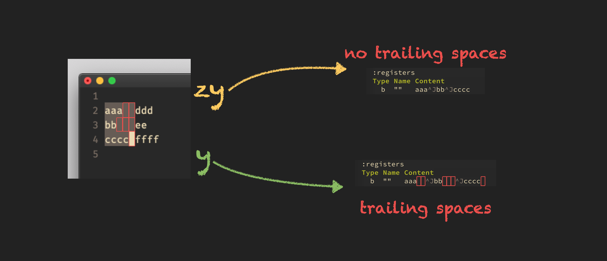
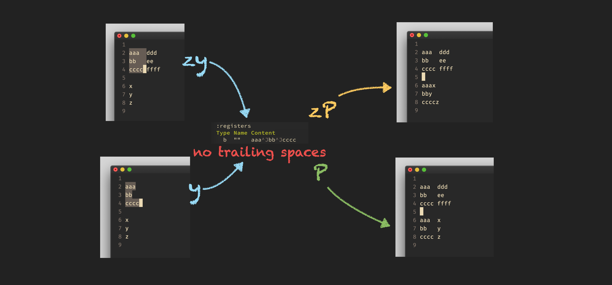

# `zy`, `zp`, `zP`

## Introduction

Vim has 3 new commands `zy`, `zp`, and `zP` that I would like to explain.

    :help zy
    :help zp
    :help zP

These 3 commands offer an alternative behavior to `y`, `p` and `P` when working with visual block
selections. Let's see how they work and compare. First I will try to describe in words what the
behavior is, followed by some examples.

## `zy` vs. `y`

When you copy text in visual block mode, and the selection has trailing whitespaces, then these
trailing whitespaces will be removed with `zy`, but not with `y`.

> Attention! - when you use `set virtualedit=block` and extend the selection until end of line using
> the `$` command, then Vim currently adds trailing whitespaces. This is a potential bug and will be
> tracked [here](https://github.com/vim/vim/issues/8495#issuecomment-872478138).

## `zp|zP` vs. `p|P`

When you paste block text from a register that has no trailing whitespaces, then `zp|zP` will paste
the text as it is, but `p|P` will append spaces if necessary to get a rectangular block.
In the following example we will paste the register before the *x* using `zP`.

A rectangular block with whitespaces will be pasted as it is with both commands.
One the left side you can see 2 ways of how you could have gotten block text without trailing
whitespaces, but it's irrelevant how you achieved it.

